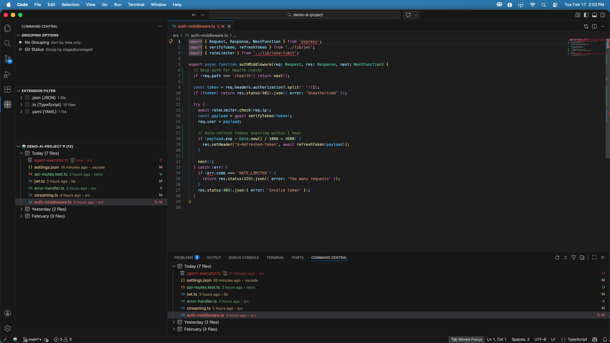

# Command Central - VS Code Extension

[](https://github.com/ostehost/command-central/actions/workflows/ci.yml)
[](https://marketplace.visualstudio.com/items?itemName=oste.command-central)
[](https://marketplace.visualstudio.com/items?itemName=oste.command-central)
[](https://opensource.org/licenses/MIT)

**Know what changed in your codebase while you were away**



*Your git changes, organized by time. See what changed today, yesterday, and beyond — with file type filtering and status indicators (Modified, Added, Deleted, Untracked).*

Command Central is a VS Code extension that organizes your git changes by time — so when you open a project after a day, a week, or a month, you instantly see what happened. No more scrolling through `git log`. No more guessing which files matter.

## Installation

Install from the [VS Code Marketplace](https://marketplace.visualstudio.com/items?itemName=oste.command-central) or search "Command Central" in VS Code Extensions.

## Overview

Command Central provides flexible access to all extension features through dedicated panels:
- **Activity Bar**: Click the radar icon for quick access
- **Panel**: Available in the bottom panel for multi-view layouts
- **Secondary Sidebar**: Drag from either location to customize your workspace

Choose the location that best fits your workflow!

## Current Features

### Git Sort - Intelligent Change Tracking
- **Time-based grouping**: Changes organized by Today, Yesterday, Last 7 days, Last 30 days, and more
- **Deleted file tracking**: Maintains stable, sequential ordering of deleted files across sessions
  - Persistent SQLite storage (desktop only)
  - Trash icon (🗑️) indicators
  - Order preserved across restore/delete cycles
  - Survives VS Code restarts
- **File type filtering**: Filter by code, config, docs, images, tests, or custom extensions
- **Sort order toggle**: Switch between newest-first (▼) and oldest-first (▲)
- **Performance optimized**: Handles large repositories efficiently
- **Safe by default**: Disabled by default, includes circuit breaker

### Active File Tracking
- **Automatic highlighting**: Currently open file is automatically highlighted in the tree view
- **Time group expansion**: Parent time groups expand automatically when file is revealed
- **Multi-workspace support**: Works correctly across multi-root workspaces with isolated highlighting
- **Performance**: Instant highlighting with < 100ms latency, scales to 1000+ files
- **Native implementation**: 100% VS Code API native, no timing hacks or workarounds
- **Configurable**: Enable/disable via `commandCentral.trackActiveFile` setting (enabled by default)
- **Smart behavior**: Focus stays in editor while tree updates, non-disruptive workflow

**How It Works:**
When you open a file that has git changes, Command Central automatically:
1. Finds the file in the tree view
2. Highlights it with VS Code's standard selection color (yellow/blue)
3. Expands parent time groups if needed
4. Scrolls the tree to show the file
5. Keeps your cursor focus in the editor (non-disruptive)

**Configuration:**
```json
{
  "commandCentral.trackActiveFile": true  // default: true
}
```

## Usage

### Getting Started with Git Sort

1. **Enable Git Sort**
   - Open Command Palette (`Cmd+Shift+P` on Mac, `Ctrl+Shift+P` on Windows/Linux)
   - Run `Command Central: Enable Git Sort`
   - Or enable in Settings: `commandCentral.gitSort.enabled: true`

2. **View Your Sorted Changes**
   - **Activity Bar**: Click the Command Central radar icon (left sidebar)
   - **Panel**: Find Command Central in the bottom panel (with Terminal, Problems, etc.)
   - **Secondary Sidebar**: Drag from either location to the right sidebar
   - Changes are grouped by time periods (Today, Yesterday, etc.)
   - Deleted files show trash icon (🗑️) and maintain stable order

3. **Customize Your View**
   - **Toggle sort order**: Click the sort icon in view title (▼/▲)
   - **Filter by file type**: Use Command Palette → "Change File Filter"
   - **Refresh manually**: Use Command Palette → "Refresh View"

4. **Disable when needed**
   - Run `Command Central: Disable Git Sort` from Command Palette

### Layout Customization

Command Central is available in multiple locations to fit your workflow:

**Activity Bar (Left Sidebar)**
- Default location with high visibility
- Click the radar icon to open
- Best for primary workflow tools

**Panel (Bottom Panel)**
- Available alongside Terminal, Problems, and Output
- Access via bottom panel tabs
- Best for multi-panel workflows

**Secondary Sidebar (Right Sidebar)**
- Drag Command Central from Activity Bar or Panel to the right sidebar
- Allows side-by-side view with Primary Sidebar
- Best for maximizing screen real estate

**How to Move Views:**
1. Right-click on the Command Central icon
2. Select "Move to Panel" or "Move to Secondary Sidebar"
3. Or drag the view directly to your preferred location

All views remain fully functional regardless of location!

## ⌨️ Keyboard Shortcuts

Command Central supports keyboard shortcuts for a fast, mouse-free workflow:

### Global Shortcuts

| Shortcut | Action | Description |
|----------|--------|-------------|
| `Cmd+Shift+C` (Mac)<br>`Ctrl+Shift+C` (Win/Linux) | **Focus Command Central** | Open and focus the Command Central view from anywhere |

### View-Scoped Shortcuts

These shortcuts only work when Command Central is focused:

| Key | Action | Description |
|-----|--------|-------------|
| `f` | **Filter Files** | Show file type filter quick pick (All Files, Code Files, Config Files, etc.) |

**Quick Workflow Example:**
```
Cmd+Shift+C → f → [select filter] → Done!
```

Press `Cmd+Shift+C` to open Command Central, then `f` to instantly access file filtering.

**Tip:** More keyboard shortcuts coming soon! (Refresh, Sort Order toggle, and more)

## Configuration

### Quick Start

- **Custom Terminal**: Settings → Search "commandCentral.terminal.app" → Set path (e.g., `/Applications/iTerm.app`)
- **Enable Git Sort**: Command Palette → "Command Central: Enable Git Sort"
- **Configure Project**: Command Palette → "Command Central: Configure Project"

### Key Settings

#### Terminal Settings
- `commandCentral.terminal.app`: Path to custom terminal app (e.g., `/Applications/iTerm.app`)
- `commandCentral.terminal.launcherPath`: Path to launcher script
- `commandCentral.terminal.logLevel`: Logging level (`debug`, `info`, `warn`, `error`)

#### Project Settings
- `commandCentral.project.icon`: Icon/emoji for status bar (e.g., `🚀`)
- `commandCentral.project.name`: Display name for workspace

#### Git Sort Settings
- `commandCentral.gitSort.enabled`: Enable/disable sorting (default: `false`)
- `commandCentral.gitSort.logLevel`: Set logging level (default: `info`)

See [CONFIG.md](./CONFIG.md) for complete configuration reference.

## Requirements

- VS Code 1.100.0 or higher
- Git extension (built-in)

## Performance

- Sorts 100 files in <300ms
- Automatically limits to 100 files for large repositories
- Circuit breaker prevents excessive operations

## Workspace Integration

### Per-Folder Git Tracking

Command Central automatically creates a view for each workspace folder with isolated git tracking:

- **Auto-discovery**: Open a multi-root workspace, views appear instantly
- **Per-folder git**: Each view shows that folder's git repository changes
- **Deleted file tracking**: Maintains stable order per folder across restarts (using SHA256 path hashing)
- **Custom icons**: Configure icons per folder via `.vscode/settings.json`
- **View title buttons**: Refresh, sort, and filter controls per view

**Example Configuration** (in workspace folder's `.vscode/settings.json`):
```json
{
  "commandCentral.project.icon": "🚀"
}
```

See [WORKSPACE_ICON_CONFIG.md](./WORKSPACE_ICON_CONFIG.md) for complete icon customization guide.

### Current Limitations

- **10 Folder Maximum**: Only first 10 workspace folders are shown
  - Additional folders beyond 10 are hidden
  - Warning appears once when more than 10 folders detected
  - Removing a folder promotes the next folder into visibility

- **Icon Cycling**: 6 available icons rotate through 10 slots
  - Slots 1-6 get unique icons
  - Slots 7-10 repeat icons from slots 1-4

- **Folder Names**: Project views use filesystem folder names as-is
  - VS Code Activity Bar automatically uppercases titles (native behavior)
  - Custom naming not supported yet

### Git Sort

- Requires git repository
- **Deleted file persistence**: Desktop only (macOS, Windows, Linux)
  - Not available in Remote-SSH, Dev Containers, or VS Code for Web
  - Gracefully falls back to in-memory tracking (data lost on restart)
- Large deletions (1000+) not performance-tested

### Testing

See [KNOWN_LIMITATIONS.md](./KNOWN_LIMITATIONS.md) for test runner limitations and workarounds

<details>
<summary><h2>Development</h2></summary>

```bash
bun install    # Install dependencies
bun dev        # Start with hot reload
bun test       # Run all tests
bun dist       # Create .vsix distribution
```

See [CONTRIBUTING.md](./CONTRIBUTING.md) and [docs/](./docs/README.md) for full developer documentation.

</details>

## License

MIT
