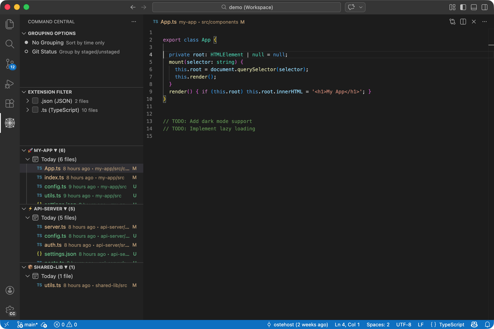

# Command Central

[](https://marketplace.visualstudio.com/items?itemName=oste.command-central)
[](https://marketplace.visualstudio.com/items?itemName=oste.command-central)
[](https://github.com/ostehost/command-central/actions/workflows/ci.yml)
[](https://opensource.org/licenses/MIT)

## Code changes, sorted by time

See what changed, in the order it changed. — [partnerai.dev](https://partnerai.dev/?utm_source=github&utm_medium=referral&utm_campaign=launch-2026-02&utm_content=readme-hero)



## Install

```
ext install oste.command-central
```

Or search **"Command Central"** in the Extensions panel.

Works with **VS Code**, **Cursor**, and **Windsurf**.

## What it does

### Sorted by time, not name

Adjustable time groups. Minutes, hours, days.

### Staged vs. working

Toggle to separate staged from working.

### Filter by extension

See only the file types that matter.

### Plus

- **Multi repo workspaces.** Each folder gets its own isolated view (up to 10).
- **Active file tracking.** Current file auto-highlights in the tree as you work.
- **Two layout modes.** Sidebar for deep dives, Panel for cross-project comparison.
- **Deleted file persistence.** Deleted files stay visible with stable ordering across sessions.
- **Emoji icons per project.** Set an icon per workspace in `.vscode/settings.json`.
- **Zero config.** Install and go. 455 tests passing, MIT licensed.

## You've been here

🤖 **Three agents running.**
Every file they touch, sorted by the minute.

🔍 **Agent went wide.**
Filter to .ts. Then to .css. Find what matters.

☕ **Morning after.**
What changed overnight, grouped by hour.

## Requirements

- VS Code **1.100.0** or higher (or Cursor / Windsurf equivalent)
- Git (built in)

## Configuration

See [CONFIG.md](./CONFIG.md) for the full settings reference. Key settings:

| Setting | Default | Description |
|---------|---------|-------------|
| `commandCentral.gitSort.enabled` | `true` | Enable time sorted git changes |
| `commandCentral.gitStatusGrouping.enabled` | `false` | Group by staged/working with time subgroups |
| `commandCentral.gitSort.fileTypeFilter` | `all` | Filter by file type |
| `commandCentral.trackActiveFile` | `true` | Auto highlight active file in tree |

## License

[MIT](./LICENSE) — Free and open source. Always.

A [Partner AI™](https://partnerai.dev) project.
