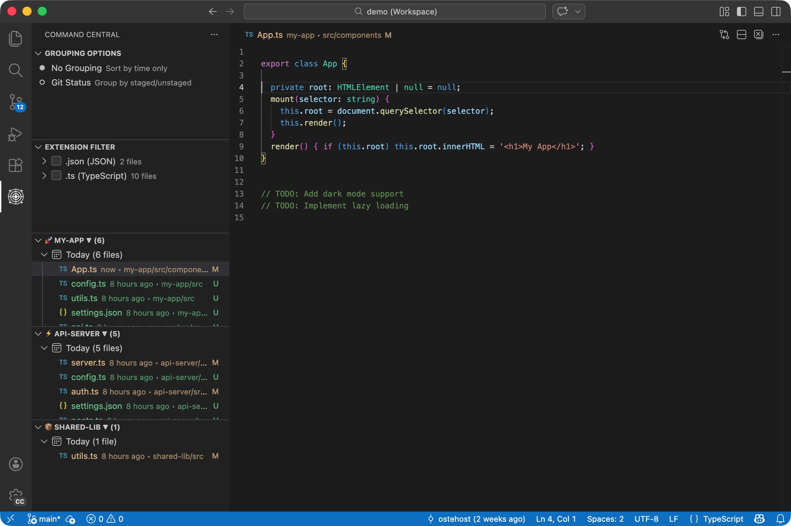

# Command Central

> **The VS Code agent control tower.** Monitor all your AI coding agents from one sidebar — even ones running in external terminals that VS Code can't see.

[](https://marketplace.visualstudio.com/items?itemName=oste.command-central)
[](https://marketplace.visualstudio.com/items?itemName=oste.command-central)
[](#)
[](https://opensource.org/licenses/MIT)

---

## The Problem

You're running 3 Claude Code agents in terminal tabs, a Codex session in tmux, and you've lost track of which one finished, which one failed, and which one is still burning tokens. You Cmd+Tab between 6 windows trying to find the right terminal. Sound familiar?

## The Solution

Command Central puts every agent — regardless of which terminal app they're running in — into a single VS Code sidebar. One glance tells you what's running, what's done, and what needs attention.



---

## Features

### 🤖 Agent Status Sidebar
- **Auto-discovery across terminals** — See Claude Code, Codex CLI, and Gemini CLI sessions running in Ghostty, iTerm2, Terminal.app, tmux, and VS Code terminals
- **Live status monitoring** — See running, completed, failed, stopped, and stuck agents at a glance
- **Click to focus** — Jump to any agent's terminal with one click
- **Auto-refresh** — Status updates every 5 seconds while agents are running (configurable)
- **Flexible sorting and grouping** — Switch between recency, status, and status-recency modes, then group by project when you need structure
- **Cross-project scope controls** — Show all tracked work or limit the sidebar to the current project
- **Git context** — See the branch and last commit for each agent
- **Per-project emoji icons** — Visually distinguish agents across projects
- **OpenClaw background tasks** — See cron runs, background agent spawns, and CLI work alongside interactive coding sessions

### 📊 Agent Dashboard (Cmd+Shift+D)
- Full agent overview in a webview panel
- Running, completed, and failed counts
- Quick actions per agent
- Same task and discovery state reflected from the sidebar

### 🔔 Notifications
- **Completion alerts** — Get notified when any agent finishes
- **Failure alerts** — Immediate notification on agent errors
- **Granular control** — Toggle completion, failure, and sound notifications independently
- **Status bar badge** — Running agent count always visible
- **Discovery diagnostics** — Open a built-in report that explains what Command Central checked and why agent discovery is or is not finding sessions

### 📋 Activity Timeline
- Agent lifecycle events are emitted from the extension for timeline-style views and future activity surfaces
- Complements the live sidebar instead of replacing it

### 📂 Git Sort (Agent Diff Tracker)
- **Time-sorted file changes** — Most recently modified files at the top
- **Multi-project support** — Up to 10 project slots for multi-root workspaces
- **Extension filter** — Filter by file type (`.ts`, `.py`, `.md`, etc.)
- **Status grouping** — Group by staged/unstaged with time-based subgroups
- **Native diff review** — Open diffs with VS Code's built-in diff picker instead of bouncing through a terminal workaround
- **Full context menu** — Open diff, copy path, reveal in explorer, compare files

### ⚡ Agent Controls
- **Launch agents** from the sidebar (with Ghostty Launcher)
- **Kill running agents** directly from VS Code
- **Restart and resume sessions** — Restart finished work or resume supported Claude, Codex, and Gemini sessions
- **View agent diffs** — See what files an agent changed with native VS Code diff flows
- **Open agent directory** — Jump to the agent's working directory
- **Capture output** — Stream agent stdout to an Output Channel
- **Show discovery details** — Debug discovery state without leaving the editor

---

## Quick Start

### 1. Install

From the [VS Code Marketplace](https://marketplace.visualstudio.com/items?itemName=oste.command-central), or:

```
code --install-extension oste.command-central
```

### 2. Open a Project

Open any folder with a Git repository. The Command Central icon appears in the Activity Bar.

### 3. Monitor Agents

Command Central auto-discovers supported Claude Code, Codex CLI, and Gemini CLI sessions automatically. When you also use Ghostty Launcher or another tool that writes a task registry, Command Central picks those up from standard locations too:

| Location | Priority |
|----------|----------|
| `${workspaceFolder}/.ghostty-launcher/tasks.json` | 1st (workspace-local) |
| `~/.config/ghostty-launcher/tasks.json` | 2nd (XDG standard) |
| `~/.ghostty-launcher/tasks.json` | 3rd (legacy) |

Or set a custom path: **Settings → Command Central: Agent Tasks File**

---

## How It Works

Command Central combines three sources of truth:

- **Process auto-discovery** for supported Claude Code, Codex CLI, and Gemini CLI sessions
- **`tasks.json` registry tracking** for launcher-managed sessions and any compatible task writer
- **OpenClaw background task visibility** for cron runs, background spawns, and CLI work

If you already have a `tasks.json` registry, any tool that writes to that format gets full sidebar integration.

```jsonc
// Example tasks.json entry
{
  "version": 2,
  "tasks": {
    "agent-myproject-planner": {
      "status": "running",           // running | completed | failed | stopped
      "project": "my-project",
      "startedAt": "2026-03-22T21:00:00Z",
      "cwd": "/Users/you/projects/my-project",
      "command": "claude --print 'Implement auth module'"
    }
  }
}
```

### Works With

| Agent | Integration |
|-------|-------------|
| **Claude Code** (Anthropic) | ✅ Auto-discovery + launcher tracking |
| **Codex CLI** (OpenAI) | ✅ Auto-discovery + launcher tracking |
| **Gemini CLI** (Google) | ✅ Auto-discovery + launcher tracking |
| **Any CLI agent** | ✅ Anything that writes `tasks.json` |
| **OpenClaw background tasks** | ✅ Sidebar visibility + cancel/notify actions |
| **Ghostty Launcher** | ✅ Full integration (auto-tracking, hooks, notifications) |

---

## Keyboard Shortcuts

| Command | macOS | Windows/Linux | Description |
|---------|-------|---------------|-------------|
| Open Command Central | Cmd+Shift+C | Ctrl+Shift+C | Focus the sidebar |
| Focus Running Agent | Cmd+Shift+U | Ctrl+Shift+U | Jump to first running agent |
| Agent Dashboard | Cmd+Shift+D | Ctrl+Shift+D | Open the dashboard panel |

**When sidebar is focused:**
| Key | Action |
|-----|--------|
| F | Filter files by extension |
| G | Toggle grouping panel |

---

## Configuration

All settings are under `commandCentral.*` in VS Code Settings (Cmd+,).

### Agent Monitoring

| Setting | Default | Description |
|---------|---------|-------------|
| `agentTasksFile` | `""` (auto-detect) | Path to tasks.json registry |
| `agentStatus.autoRefreshMs` | `5000` | Refresh interval while agents run |
| `agentStatus.stuckThresholdMinutes` | `15` | Minutes before inactive work is flagged as potentially stuck |
| `agentStatus.scope` | `"all"` | Show all tracked work or only the current workspace folders |
| `agentStatus.groupByProject` | `false` | Group the Agent Status tree by project |
| `agentStatus.sortMode` | `"recency"` | Sort by recency, status, or status-recency |
| `agentStatus.maxVisibleAgents` | `50` | Cap older non-running runs behind a "Show older runs" node |
| `agentStatus.notifications` | `true` | Master notification toggle |
| `notifications.onCompletion` | `true` | Notify on agent completion |
| `notifications.onFailure` | `true` | Notify on agent failure |
| `notifications.sound` | `false` | Play sound with notifications |
| `notifications.autoDismissSeconds` | `10` | Auto-dismiss delay for agent notifications (`0` disables auto-dismiss) |
| `discovery.enabled` | `true` | Enable automatic agent discovery outside the launcher |

### Git Sort

| Setting | Default | Description |
|---------|---------|-------------|
| `gitSort.enabled` | `true` | Enable time-sorted file view |
| `gitSort.fileTypeFilter` | `"all"` | Filter: `all`, `custom` |
| `gitSort.customFileTypes` | `[]` | Custom extensions: `[".vue", ".svelte"]` |
| `gitStatusGrouping.enabled` | `false` | Group by staged/unstaged |
| `trackActiveFile` | `true` | Highlight active file in tree |

### Display

| Setting | Default | Description |
|---------|---------|-------------|
| `project.name` | workspace name | Display name for this project |
| `project.icon` | — | Emoji icon for this project |
| `project.group` | `""` | Optional project-group override in Agent Status |
| `projects` | `[]` | Per-project emoji mappings |
| `statusBar.showProjectIcon` | `true` | Show icon in status bar |
| `statusBar.priority` | `10000` | Status bar position (higher = left) |
| `ghostty.launcherPath` | `""` (auto-detect) | Path to Ghostty Launcher |

---

## Requirements

- **VS Code 1.100.0+** (or compatible: Cursor, Windsurf, etc.)
- **Git** — for Git Sort features
- **Node 18+** — runtime requirement

### Optional

- [**Ghostty Launcher**](https://github.com/ostehost/ghostty-launcher) — for full agent lifecycle management (launch, auto-track, hooks, notifications). Without it, you can still monitor any agent that writes to tasks.json.

---

## Roadmap

| Version | Milestone | Status |
|---------|-----------|--------|
| v0.3.x | Agent sidebar, dashboard, notifications, Git Sort | ✅ Shipped |
| v0.4.x | External user onboarding, Marketplace listing, launcher fallbacks | ✅ Shipped |
| v0.5.x | Auto-discovery, resume, OpenClaw tasks, diagnostics, native diff picker | ✅ Shipped |
| v0.7.0 | Launch — Show HN, first 100 users | 🔨 In Progress |
| v0.8.0 | Post-launch expansion — ACP visibility, provenance, workflow polish | 📋 Planned |
| v1.0 | Pro tier — cost tracking, stuck detection | 📋 Planned |

See [ROADMAP.md](./ROADMAP.md) for the full plan and [CHANGELOG.md](./CHANGELOG.md) for release history.

---

## Telemetry

Command Central collects anonymous usage data to improve the extension. We track:

- Extension activation and feature usage counts
- VS Code version, OS, extension version

We do **NOT** collect: file names, repository names, code content, or any personal data.

Disable via: Settings → Command Central → Telemetry: Enabled (uncheck), or set VS Code's `telemetry.telemetryLevel` to `off`.

---

## Contributing

See [CONTRIBUTING.md](./CONTRIBUTING.md) for development setup, testing, and PR guidelines.

```bash
# Clone and install
git clone https://github.com/ostehost/command-central.git
cd command-central
bun install

# Run tests (674 tests, 1402 assertions)
bun test

# Build VSIX
just dist
```

---

## License

[MIT](./LICENSE) — Free and open source. Always.

---

**Stop managing terminals. Start managing agents.**
