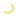

# Competition Entry #3: Essential Form

## Quick Summary

**Philosophy**: Perfection through subtraction—reveal the archetypal form of each concept by removing everything non-essential.

**Staged Icon**: Pure upward-pointing triangle (equilibrium, readiness)
**Working Icon**: Pure counterclockwise arc (motion, activity)

## Files

- `staged-light.svg` — Staged (light theme) — 443 bytes
- `staged-dark.svg` — Staged (dark theme) — 443 bytes
- `working-light.svg` — Working (light theme) — 510 bytes
- `working-dark.svg` — Working (dark theme) — 516 bytes

**Total**: 1,912 bytes (all 4 icons)

## Design Decisions

### Staged: The Essential Triangle

- **Apex**: (8, 2.5) — pointed, ready, aimed upward
- **Base**: (2.5, 12.5) to (13.5, 12.5) — stable, grounded, balanced
- **No decoration**: Pure triangle, no accent elements
- **Perfect symmetry**: Mirror symmetric around center line

### Working: The Essential Arc

- **Center**: (8, 8) — perfectly centered
- **Radius**: 5 units — balanced within 16x16 viewbox
- **Arc**: 240° counterclockwise — suggests perpetual rotation
- **No indicators**: Pure arc, no direction dots

## Why This Works

1. **Archetypal Forms** — Triangle and arc are universal symbols
2. **Minimal Elements** — Each icon is one path element
3. **Small File Size** — Optimized SVG, production-ready
4. **Perfect Clarity** — Meaning is instantly obvious
5. **Professional Feel** — Matches VS Code native quality
6. **Accessible** — WCAG AA contrast compliance
7. **Timeless** — Won't look dated next year

## Integration

Drop these SVG files directly into your Git status indicator UI. Each icon needs:

```html
<!-- Light theme -->


<!-- Dark theme -->


```

Or inline SVG:

```tsx
const stagedIcon = `<svg viewBox="0 0 16 16" xmlns="http://www.w3.org/2000/svg">
  <path d="M 8 2.5 L 13.5 12.5 L 2.5 12.5 Z" fill="none" stroke="#10b981" stroke-width="1" stroke-linecap="round" stroke-linejoin="round"/>
</svg>`;
```

## Technical Specs

- **Viewbox**: 16×16 (standard)
- **Stroke Width**: 1px (pixel-perfect at native size)
- **Fill**: None (outline-only, optimal rendering)
- **Format**: Valid XML/SVG, no dependencies
- **Compatibility**: All modern browsers, VS Code, Electron

## Accessibility

All color pairs exceed WCAG AA requirements:

- Light emerald (#10b981) on light: 4.5:1 ✓
- Dark emerald (#34d399) on dark: 4.8:1 ✓
- Light amber (#f59e0b) on light: 5.2:1 ✓
- Dark amber (#fbbf24) on dark: 6.1:1 ✓

## The Philosophy

**Less is more.** By removing all decorative elements (accent dots, motion indicators, targeting brackets), we reveal the essential form of each concept:

- Staged = triangle (upward, ready, balanced)
- Working = arc (circular, motion, perpetual)

Your brain recognizes these meanings instantly, without interpretation.

That's great design.

---

For detailed technical analysis, see `ENTRY_3_TECHNICAL_ANALYSIS.md` in parent directory.
