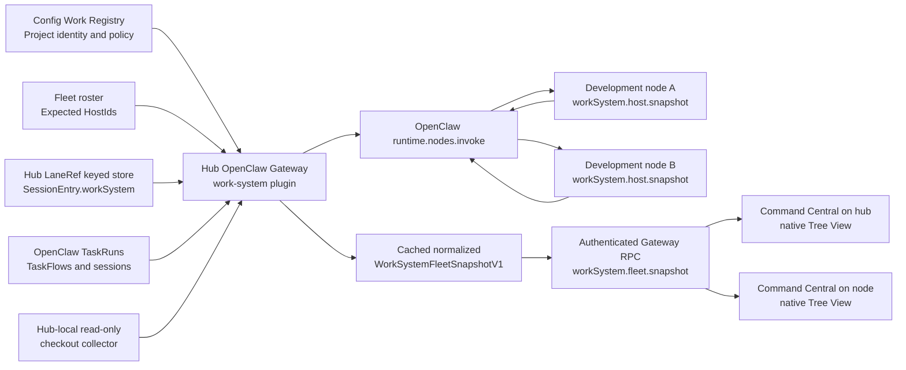

# Command Central: OpenClaw-Native Fleet Work Surface — Implementation Spec v1

Date: 2026-07-12
Status: Final implementation plan; conditionally approved for Phase 0 only
Owners: OpenClaw Work System, Work Registry, and Command Central
Scope: OpenClaw-native fleet aggregation plus a native VS Code Tree View
Implementation posture: Documentation only; this artifact does not authorize production rollout

## 1. Executive decision

Command Central will provide a native VS Code sidebar view of projects, work,
and checkout state across the OpenClaw hub and development nodes.

The architectural boundary is:

- The OpenClaw hub Gateway is the existing aggregation and control plane.
- The hub-owned `work-system` plugin is the only authoritative LaneRef store.
- The same plugin package runs on development nodes only to provide a fixed,
  bounded, read-only host observation command. A node does not own or replicate
  authoritative lane state.
- OpenClaw owns TaskRuns, TaskFlows, sessions, node connectivity, and gateway
  authentication.
- The Config Work Registry owns canonical project identity and lane policy.
- Command Central owns presentation, filtering, refresh orchestration, and
  VS Code-native navigation only.
- Partner Dashboard is a behavioral reference and golden-fixture oracle. It is
  not a runtime dependency.

V1 MUST NOT introduce:

- a new HTTP server, listener, daemon, or localhost application endpoint;
- a sidebar webview or a browser bundle;
- a Partner Dashboard process, endpoint, or generated artifact dependency;
- arbitrary `system.run`, caller-controlled paths, or remote shell execution;
- a second lane, task, session, or project source of truth;
- Git mutation, including `fetch`, `pull`, `checkout`, `reset`, `merge`,
  `commit`, `push`, or worktree creation.

The OpenClaw Gateway is an existing prerequisite, not a new server introduced
by this feature. If the Gateway is unreachable, a client cannot truthfully
observe live remote state. The UI must show that limitation explicitly.

## 2. Implementation readiness verdict

Architecture verdict: **CONDITIONAL GO FOR PREFLIGHT ONLY**.

Current implementation verdict: **NO-GO until G0; then phase-by-phase only**.

The Command Central tree must not be implemented against imaginary APIs. The
first implementation slice is the shared contracts and native Work System
plugin. Command Central source/controller work starts only after the plugin
contract is executable in an isolated OpenClaw profile. Native UI work starts
only after the fleet snapshot passes aggregation and failure-mode tests.

### 2.1 Required gates

| Gate | Required evidence | Current state on 2026-07-12 | Rule |
| --- | --- | --- | --- |
| G0 — preflight and ownership | Repositories, branches, dirty files, installed OpenClaw version, plugin workspace, and test commands are recorded | Not yet recorded by an implementation agent | No production, schema, registry, or implementation edits before G0; the preflight receipt is the sole permitted artifact |
| G1 — shared contracts | Versioned TypeScript DTOs, strict runtime decoders, Work Registry v3 placements with v2 dual-read, a two-compute fixture, JSON fixtures, and schema compatibility tests pass | Missing | Only contract/fixture work may proceed |
| G2 — authoritative Work System | `workSystem.projects.list`, `workSystem.lanes.list`, session projection, and keyed-store tests pass in an isolated profile | Plugin is not installed; live call returns `unknown method` | No Command Central integration |
| G3 — host observation | Hub collector and `workSystem.host.snapshot` return the same redacted contract; node command is advertised and policy-allowlisted | Command is not advertised | No fleet aggregation |
| G4 — aggregate parity | Fleet snapshot matches the catalog, tasks, flows, sessions, lanes, hosts, freshness, and unassigned-work fixtures | Unproven | No native tree |
| G5 — Gateway client | Command Central can authenticate, decode, cancel, time out, and distinguish gateway/plugin/schema failures | Only readiness URL resolution exists | No polling or view registration |
| G6 — native UI | Tree, filters, stable IDs, degraded states, accessibility, and package contribution tests pass | Not started | No VSIX rollout |
| G7 — real fleet proof | Hub and node plugin builds match; offline and registry-skew drills pass; installed VSIX works from a node connected to the hub Gateway | Not started | No default enablement or bridge retirement |

If any preflight observation contradicts the source-of-truth, topology,
identity, security, or no-new-server decisions in this document, the
implementation agent MUST stop and revise this artifact before coding.

## 3. User outcome

The Fleet Projects view must let an operator answer, without leaving VS Code:

1. Which registered projects exist across the fleet?
2. Which projects need sync, publish, agent attention, or verification?
3. What active lanes, tasks, flows, and sessions belong to each project?
4. On which physical host is work running?
5. What is the observed checkout state on the hub and each development node?
6. How fresh is every fact, and which facts are unavailable or stale?
7. Which OpenClaw work cannot be safely attributed to a project?
8. What read-only navigation or source-owned action is safe from the selected
   row?

The view must remain useful with no VS Code workspace folders open. The Work
Registry, not workspace-folder discovery, defines the project row universe.

## 4. Verified current-state evidence

The distinction between verified fact and proposed design is normative.

| Classification | Fact | Evidence | Implication |
| --- | --- | --- | --- |
| Verified fact | Installed OpenClaw is `2026.6.11` | `openclaw --version` | The implementation must pin and recheck this minimum or a later proven-compatible version |
| Verified fact | Native plugins can register gateway methods, services, node-host commands, invoke policies, and security audit collectors | Installed plugin SDK declarations around `registerGatewayMethod`, `registerNodeHostCommand`, `registerNodeInvokePolicy`, and `registerService` | No HTTP or generic remote execution is needed |
| Verified fact | Plugin runtime exposes `nodes.list()` and `nodes.invoke()` | Installed plugin SDK `PluginRuntime.nodes` | The hub plugin can fan out to paired development nodes |
| Verified fact | Plugin runtime exposes keyed state, session-entry reads, TaskRuns, and TaskFlows | Installed plugin SDK runtime types | The plugin can own lane state and build OpenClaw-native work projections |
| Verified fact | Core Gateway methods `tasks.list` and `sessions.list` are live | Redacted terminal-page probes returned 377 tasks over four pages and 120 sessions over two pages on 2026-07-12 | Full task/session aggregation must be compared with these core surfaces; counts are ephemeral and must be re-run |
| Verified fact | The `work-system` plugin is not installed | `openclaw plugins list --json` has no `work-system` row | The documented API is a design, not a live dependency |
| Verified fact | `workSystem.projects.list` currently fails | Live gateway call returns `INVALID_REQUEST: unknown method` | G2 is blocked |
| Verified fact | A MacBook development node is connected | `openclaw nodes status --json` | Real node invocation can be tested after G3 |
| Verified fact | No node currently advertises `workSystem.host.snapshot` | Bounded node-status projection | G3 is blocked |
| Verified fact | The Work Registry is schema v2 with 18 active projects | `~/projects/config/openclaw/conductor/work-registry.json` | Baseline live proof should return 18 while acceptance logic compares dynamically to the registry |
| Verified fact | Work Registry v2 has one `hub` and one `node` path per project | `work-registry.schema.json` | It cannot faithfully represent distinct paths on multiple compute hosts |
| Verified fact | The fleet roster separates a stable `idHash`, human label, and fleet role | `~/projects/config/openclaw/lib/fleet-roster.json` | `idHash` is the candidate physical HostId; labels are display-only |
| Verified fact | The Work System reference schema currently calls the `hub|node` role a `hostId` | `work-system-refs.schema.json` definition `hostId` | The contract must separate physical host identity from checkout role before multi-node support |
| Verified fact | Work System design declares its keyed store final lane truth and `lanes.json` transitional | `~/projects/config/openclaw/work-system/PLUGIN-API.md` | Command Central must migrate toward gateway state, not deepen the file bridge |
| Verified fact | Command Central labels the current lanes projection bridge-only | `src/providers/agent-task-normalize.ts` | Native source precedence can be introduced without changing doctrine |
| Verified fact | Command Central independently polls OpenClaw tasks and TaskFlows today | `src/services/openclaw-task-service.ts` and `src/services/taskflow-service.ts` | The final controller must prevent duplicate polling and duplicate rows |
| Verified fact | Command Central already groups registry-backed work by `project_ref.id` | `src/providers/agent-status-tree-provider.ts` | The new view must preserve canonical ProjectId grouping |
| Verified fact | Command Central already resolves a remote Gateway readiness URL from OpenClaw config | `src/utils/openclaw-gateway-health.ts` | A node-side VS Code instance can target the hub Gateway |
| Verified fact | Command Central already registers native Tree Views | `src/extension.ts` and `package.json` | The new surface fits existing VS Code-native patterns |
| Verified fact | Partner Dashboard defines exact fleet groups and agenda subgroups | `fleetGroups.ts`, `alignCohorts.ts`, and `alignAgenda.ts` | Classification parity must be fixture-tested, not reinterpreted in UI code |
| Verified fact | The live `/projects` screen presents independent catalog/fleet/node ages, a project total, cohort rollups, view filters, hub/node checkout columns, changed/ahead/behind summaries, and bulk mutation controls | Read-only in-app inspection of `https://dashboard.partnerai.dev/projects` on 2026-07-12 | Port the information hierarchy and freshness cues, generalize columns to physical hosts, and deliberately exclude its mutation/privacy-sensitive details from v1 |

### 4.1 Repository state observed while writing this spec

On 2026-07-12:

- `~/projects/command-central` was clean before this document was added.
- `~/.openclaw/workspace` was clean.
- `~/projects/partner-dashboard` contained user-owned changes, including its
  collector, fetch, development-server, and test files.
- `~/projects/config` contained extensive user-owned changes across OpenClaw
  configuration, runbooks, scripts, skills, tests, and shared tooling.

These observations expire. G0 MUST re-run status checks. An implementation
agent must not modify or overwrite an existing dirty checkout. Cross-repository
work should use coordinated branches or isolated worktrees after overlap has
been assessed.

## 5. Goals

V1 goals are:

- one native Fleet Projects Tree View in the Command Central sidebar;
- the complete active Work Registry catalog, independent of open folders;
- hub and development-node checkout observations from OpenClaw-native
  collectors;
- active LaneRefs, TaskRuns, TaskFlows, and session projections;
- canonical project attribution using explicit IDs;
- a visible Unassigned Work section for records lacking safe attribution;
- exact Partner Dashboard cohort semantics where inputs are complete;
- explicit source clocks and degraded states;
- native VS Code search/filter, commands, icons, tooltips, context menus,
  keyboard navigation, and accessibility;
- a strict TypeScript contract that can be tested without VS Code or a live
  Gateway;
- bounded collection, fanout, payload size, refresh, and render cost;
- a migration path that proves native/file parity before retiring transitional
  readers.

## 6. Non-goals

V1 does not:

- replace Agent Status, Symphony, Cron Jobs, or Git Sort;
- make Command Central a scheduler or lifecycle authority;
- create, bind, cancel, steer, focus, or mutate work unless a specific
  source-owned OpenClaw action is separately proven and approved;
- infer project identity from a path, cwd, label, task title, repository
  basename, display name, or branch;
- run Git against a caller-supplied path;
- fetch remotes or claim remote-tracking references are current;
- show file-level diffs or changed filenames in the fleet projection;
- reproduce Partner Dashboard HTML, CSS, React components, server routes, or
  generated data files;
- add a general remote filesystem or command transport;
- solve multiple compute-node placement by collapsing all machines into one
  `node` column;
- persist full fleet payloads in Command Central global state;
- remove transitional sources before a measured parity and soak gate.

## 7. Source-of-truth and ownership matrix

| Information | Authority | Projection/cache | Forbidden substitute |
| --- | --- | --- | --- |
| Project ID, display name, status, tracker binding, lane policy | Config Work Registry plus `oc-project` resolver | Fleet snapshot project summary | Folder name, cwd, task label |
| Expected physical fleet hosts | Fleet roster | Fleet snapshot host list | Connected-node list alone |
| LaneRef records and indexes | Hub `work-system` keyed store | `SessionEntry.workSystem`, Fleet snapshot | `lanes.json`, TaskFlow, UI state |
| Per-session lane binding | Hub store | `SessionEntry.workSystem` read projection | Direct SessionEntry mutation |
| TaskRun lifecycle | OpenClaw Task registry | Fleet snapshot task summary | Process inference, launcher status overlay |
| TaskFlow lifecycle | OpenClaw TaskFlow registry | Fleet snapshot flow summary | Synthetic UI grouping |
| Session activity | OpenClaw session APIs | Fleet snapshot session summary | Transcript-file scanning |
| Hub checkout observation | Hub plugin local collector | Derived fleet cache | Partner Dashboard artifact |
| Node checkout observation | Node plugin host command | Hub last-good host cache | `system.run`, arbitrary `file.fetch` |
| Fleet aggregate | Hub `work-system` service | Cached `workSystem.fleet.snapshot` result | Command Central local federation |
| Classification | Shared pure classifier using authoritative aggregate | Project `groupId` and optional `agendaGroupId` | UI-specific reclassification |
| Filter, expansion, selection, visible refresh | Command Central | Extension memory and VS Code state | OpenClaw domain state |
| Transitional launcher lane projection | Ghostty Launcher bridge | `~/.config/openclaw/lanes.json` | Final authority |

The node installation of the plugin MUST NOT open a LaneRef keyed store as a
second authority. Node runtime registration is limited to the host observation
handler and any required local configuration validation.

## 8. Target topology and data flow



Important topology rules:

1. The hub Gateway remains gateway-only; it does not need to become an
   OpenClaw file/exec node.
2. Hub checkout collection runs inside the hub plugin service using the same
   pure collector used by the node-host command.
3. Development nodes advertise exactly the plugin-owned snapshot command.
4. A Command Central instance on any machine reads the same hub-owned fleet
   aggregate through its configured Gateway connection.
5. A disconnected node remains in the response because the fleet roster, not
   `nodes.list({connected: true})`, defines expected hosts.
6. An unreachable Gateway yields an unavailable client state. Command Central
   does not create a peer-to-peer fallback control plane.

## 9. Identity and placement model

### 9.1 Required identities

| Name | Meaning | Source | May be displayed | May be a join key |
| --- | --- | --- | --- | --- |
| `ProjectId` | Canonical registered project | Work Registry `projects[].id` | Yes | Yes |
| `HostId` | Stable physical fleet machine | Fleet roster `idHash` or a proven equivalent | Yes, preferably through label | Yes |
| OpenClaw `nodeId` | Current transport routing identity | Gateway node connection | No by default | Only inside transport mapping |
| `FleetRole` | Operational host class: `hub`, `compute`, `companion` | Fleet roster | Yes | No |
| `CheckoutRole` | Project path/scheduling role: `hub` or `node` | Work Registry compatibility model | Yes | Yes only with ProjectId and HostId |
| Display label | Human host/project name | Registry/roster | Yes | Never |
| `LaneId`, `TaskId`, `FlowId`, `SessionKey` | Source-owned work identities | OpenClaw/Work System | Selected forms | Yes within their source namespace |

Checkout state keys are:

```text
(ProjectId, HostId, CheckoutRole)
```

No two physical hosts may be merged because they share `CheckoutRole: "node"`.

### 9.2 Work Registry compatibility and migration

Work Registry v2 provides:

```text
projects[].paths.hub
projects[].paths.node
projects[].lanePolicy.defaultHost = "hub" | "node"
```

Those values represent checkout roles, not physical machine identity.

The v2 compatibility adapter MAY map:

- `paths.hub` to the one roster host with `FleetRole: "hub"`;
- `paths.node` to the one roster host with `FleetRole: "compute"`.

It MUST fail closed with `unsupported-topology` when more than one expected
compute host would share the one v2 `paths.node` value. It must not silently
duplicate that path or collapse the hosts.

Multi-compute support requires a versioned Work Registry migration with
explicit placements:

```ts
export interface ProjectPlacementV1 {
  readonly hostId: HostId;
  readonly checkoutRole: CheckoutRole;
  readonly path: string | null;
}
```

The proposed registry representation is `projects[].placements[]`. Paths remain
local configuration data and MUST NOT appear in fleet RPC DTOs.

V1's target includes multiple development nodes. Therefore G1 MUST deliver the
versioned placements schema, dual-read compatibility, and a two-compute fixture
before the full target can pass G4 or G7. Work Registry v2 is supported only as
a compatibility path for the current one-hub/one-compute topology.

The existing lane-policy role may remain for scheduling compatibility, but a
bound LaneRef must gain a stable physical `hostId`. A versioned LaneRef
migration must distinguish:

- `hostId`: physical host;
- `checkoutRole`: semantic `hub|node` role;
- legacy `host`: accepted only by a compatibility decoder.

Unknown, ambiguous, duplicate, or conflicting identities are diagnostics, not
merge candidates.

## 10. Shared TypeScript contract package

### 10.1 Ownership

There must be one dependency-free contract source used by the OpenClaw plugin
and Command Central. The canonical source belongs beside the Work System
vocabulary, not inside Partner Dashboard or a VS Code provider.

G0 must choose and prove the package/distribution path. Acceptable outcomes
are:

1. a versioned package that both builds consume and Command Central bundles
   into the VSIX; or
2. generated consumer artifacts from one canonical source, protected by a
   schema hash and generated-file drift test.

Two independently handwritten DTO sets are not acceptable.

The package must export:

- branded domain IDs;
- wire DTO interfaces;
- exact string unions and order constants;
- strict `unknown` decoders;
- canonical sorting and normalization helpers;
- classification and merge pure functions;
- safe fixture builders for tests;
- JSON Schemas or an equivalent machine-readable schema artifact;
- contract version and minimum OpenClaw capability constants.

No VS Code, filesystem, Git, OpenClaw runtime, or Partner Dashboard imports are
allowed in this package.

### 10.2 Type discipline

Untrusted JSON enters as `unknown`. A TypeScript assertion does not validate
runtime data.

Production code MUST contain:

- no `any`;
- no `as WorkSystemFleetSnapshotV1` cast at a JSON boundary;
- no reflection tests or test-only production methods;
- exhaustive `switch` handling for every discriminated union;
- `readonly` transport and domain fields;
- finite integer, timestamp, length, uniqueness, and additional-property
  validation;
- stable deterministic ordering before serialization.

The decoder contract is:

```ts
export interface DecodeIssue {
  readonly path: readonly (string | number)[];
  readonly code: DecodeIssueCode;
  readonly message: string;
}

export type DecodeIssueCode =
  | "type"
  | "required"
  | "additional-property"
  | "format"
  | "range"
  | "length"
  | "duplicate"
  | "version"
  | "invariant"
  | "truncated";

export type DecodeResult<T> =
  | { readonly ok: true; readonly value: T }
  | { readonly ok: false; readonly issues: readonly DecodeIssue[] };

export interface FleetContractCodec {
  decodePluginConfig(input: unknown): DecodeResult<WorkSystemPluginConfigV1>;
  decodeHostSnapshotRequest(input: unknown): DecodeResult<WorkSystemHostSnapshotRequestV1>;
  decodeHostSnapshotResult(input: unknown): DecodeResult<WorkSystemHostSnapshotResultV1>;
  decodeHostSnapshot(input: unknown): DecodeResult<WorkSystemHostSnapshotV1>;
  decodeFleetSnapshotRequest(input: unknown): DecodeResult<WorkSystemFleetSnapshotRequestV1>;
  decodeFleetSnapshot(input: unknown): DecodeResult<WorkSystemFleetSnapshotV1>;
  decodeFleetRefreshRequest(input: unknown): DecodeResult<WorkSystemFleetRefreshRequestV1>;
  decodeFleetRefreshResult(input: unknown): DecodeResult<WorkSystemFleetRefreshResultV1>;
  decodeHostCacheRecord(input: unknown): DecodeResult<FleetHostCacheRecordV1>;
  decodeWorkRegistry(input: unknown): DecodeResult<ValidatedWorkRegistry>;
  decodeFleetRoster(input: unknown): DecodeResult<ValidatedFleetRoster>;
}
```

Decoder messages are static allowlisted templates. They may name a schema
field through `path` but never interpolate rejected values, raw payload text,
paths, IDs, titles, or exceptions.

The lane core exports a parallel `LaneContractCodec` covering every listed
project/lane/session Gateway request and result. No registered handler, node
transport, Gateway adapter, config load, registry/roster load, or persisted
cache load may consume JSON without the corresponding `unknown` decoder.

### 10.3 Canonical enums

```ts
export type CheckoutRole = "hub" | "node";
export type FleetRole = "hub" | "compute" | "companion";

export type FleetGroupId =
  | "sync"
  | "publish"
  | "agent"
  | "settling"
  | "aligned"
  | "no-plan-data";

export const FLEET_GROUP_ORDER: readonly FleetGroupId[] = [
  "sync",
  "publish",
  "agent",
  "settling",
  "aligned",
  "no-plan-data",
];

export type AgendaGroupId =
  | "maintenance"
  | "judgment"
  | "node-publish"
  | "node-ff"
  | "stale"
  | "blocked";

export const AGENDA_GROUP_ORDER: readonly AgendaGroupId[] = [
  "maintenance",
  "judgment",
  "node-publish",
  "node-ff",
  "stale",
  "blocked",
];

export type SourceState =
  | "fresh"
  | "partial"
  | "stale"
  | "offline"
  | "unsupported"
  | "timeout"
  | "unavailable"
  | "error"
  | "clock-skew"
  | "registry-mismatch"
  | "roster-mismatch"
  | "mixed-version"
  | "schema-mismatch";

export type SourceErrorCode =
  | "gateway-unavailable"
  | "node-disconnected"
  | "command-unsupported"
  | "invoke-timeout"
  | "response-too-large"
  | "schema-invalid"
  | "registry-mismatch"
  | "roster-mismatch"
  | "clock-skew"
  | "duplicate-host"
  | "collection-failed"
  | "cache-corrupt"
  | "cache-expired"
  | "topology-unsupported"
  | "mixed-version"
  | "deadline-exhausted"
  | "aggregate-over-cap"
  | "result-truncated";

export type HostDiagnosticCode =
  | "registry-mismatch"
  | "roster-mismatch"
  | "host-not-in-roster"
  | "host-role-mismatch"
  | "placement-not-assigned"
  | "probe-timeout"
  | "probe-output-limit"
  | "probe-failed"
  | "deadline-not-probed"
  | "result-truncated";

export type FleetDiagnosticCode =
  | HostDiagnosticCode
  | "unknown-project"
  | "duplicate-host"
  | "lane-session-mismatch"
  | "conflicting-project-bindings"
  | "conflicting-host-bindings"
  | "cache-corrupt"
  | "cache-expired"
  | "mixed-version"
  | "aggregate-over-cap"
  | "topology-unsupported";

export type ClassificationReasonCode =
  | "sync-ready"
  | "publish-ready"
  | "agent-required"
  | "push-propagating"
  | "all-aligned"
  | "insufficient-fresh-data"
  | "missing-placement"
  | "source-stale"
  | "remote-currency-unproven"
  | "registry-mismatch"
  | "roster-mismatch"
  | "topology-unsupported"
  | "classifier-error";

export type CheckoutClass =
  | "synced"
  | "fast-forward"
  | "push-ready"
  | "diverged"
  | "dirty"
  | "conflicted"
  | "detached"
  | "off-main"
  | "no-upstream"
  | "blocked";

export type RecommendedAction =
  | "none"
  | "ff-merge"
  | "ff-push"
  | "agent"
  | "report-only";

export type CheckoutExecution = "hub-local" | "delegated" | "none";

export type HostCommandErrorCode =
  | "contract-unsupported"
  | "registry-mismatch"
  | "roster-mismatch"
  | "host-identity-mismatch"
  | "host-role-mismatch"
  | "collection-failed"
  | "response-too-large";
```

### 10.4 Host snapshot contract

The node command and hub-local collector return the same DTO:

```ts
export interface WorkSystemHostSnapshotV1 {
  readonly kind: "openclaw.work-system.host-snapshot";
  readonly schemaVersion: 1;
  readonly generatedAt: string;
  readonly pluginVersion: string;
  readonly openclawVersion: string;
  readonly supportedSchemaVersions: readonly [1];
  readonly collectorVersion: string;
  readonly cruftPolicyVersion: string;
  readonly registryFingerprint: string;
  readonly rosterFingerprint: string;
  readonly comparisonId: string;
  readonly host: {
    readonly hostId: HostId;
    readonly fleetRole: Exclude<FleetRole, "companion">;
    readonly checkoutRoles: readonly CheckoutRole[];
  };
  readonly coverage: {
    readonly expectedCheckoutCount: number;
    readonly observedCheckoutCount: number;
    readonly notProbedCount: number;
    readonly complete: boolean;
    readonly nextStartIndex: number | null;
  };
  readonly checkouts: readonly HostCheckoutObservationV1[];
  readonly diagnostics: readonly HostDiagnosticV1[];
}

export interface HostCheckoutObservationV1 {
  readonly projectId: ProjectId;
  readonly hostId: HostId;
  readonly checkoutRole: CheckoutRole;
  readonly observedAt: string;
  readonly state:
    | {
        readonly kind: "ready";
        readonly branch: string | null;
        readonly detached: boolean;
        readonly upstreamExists: boolean | null;
        readonly baseRef: string | null;
        readonly trackingRefCurrency: "unverified" | "verified-current";
        readonly trackingRefSource: "local-only" | "openclaw-remote-attestor-v1";
        readonly trackingRefVerifiedAt: string | null;
        readonly ahead: number | null;
        readonly behind: number | null;
        readonly changedCount: number;
        readonly trackedChangedCount: number;
        readonly untrackedChangedCount: number;
        readonly conflictedCount: number;
        readonly cruftOnly: boolean;
        readonly revisionFingerprint: string | null;
      }
    | {
        readonly kind: "missing";
        readonly reason: "path-not-configured" | "path-not-found" | "not-a-repository";
      }
    | {
        readonly kind: "error";
        readonly reason:
          | "timeout"
          | "output-limit"
          | "git-unavailable"
          | "permission-denied"
          | "probe-failed";
      }
    | {
        readonly kind: "not-probed";
        readonly reason: "deadline-exhausted" | "snapshot-size-cap";
      };
}

export interface HostDiagnosticV1 {
  readonly code: HostDiagnosticCode;
  readonly projectId: ProjectId | null;
  readonly severity: "info" | "warning" | "error";
}
```

`HostDiagnosticV1` carries allowlisted codes only. It never carries raw stderr,
paths, commands, environment values, or stack traces.

The public fleet DTO removes `revisionFingerprint`, adds hub receipt and
classifier fields at the tuple level, and adds a synthetic `unavailable` arm
for expected placements with no usable host evidence:

```ts
export interface FleetCheckoutObservationV1 {
  readonly projectId: ProjectId;
  readonly hostId: HostId;
  readonly checkoutRole: CheckoutRole;
  readonly observedAt: string | null;
  readonly receivedAt: string | null;
  readonly checkoutClass: CheckoutClass;
  readonly recommendedAction: RecommendedAction;
  readonly execution: CheckoutExecution;
  readonly state:
    | {
        readonly kind: "ready";
        readonly branch: string | null;
        readonly detached: boolean;
        readonly upstreamExists: boolean | null;
        readonly baseRef: string | null;
        readonly trackingRefCurrency: "unverified" | "verified-current";
        readonly trackingRefSource: "local-only" | "openclaw-remote-attestor-v1";
        readonly trackingRefVerifiedAt: string | null;
        readonly ahead: number | null;
        readonly behind: number | null;
        readonly changedCount: number;
        readonly trackedChangedCount: number;
        readonly untrackedChangedCount: number;
        readonly conflictedCount: number;
        readonly cruftOnly: boolean;
      }
    | {
        readonly kind: "missing";
        readonly reason: "path-not-configured" | "path-not-found" | "not-a-repository";
      }
    | {
        readonly kind: "error";
        readonly reason:
          | "timeout"
          | "output-limit"
          | "git-unavailable"
          | "permission-denied"
          | "probe-failed";
      }
    | {
        readonly kind: "not-probed";
        readonly reason: "deadline-exhausted" | "snapshot-size-cap";
      }
    | {
        readonly kind: "unavailable";
        readonly reason:
          | "source-unavailable"
          | "host-offline"
          | "command-unsupported"
          | "registry-mismatch"
          | "roster-mismatch"
          | "schema-mismatch"
          | "mixed-version"
          | "clock-skew";
      };
}
```

The aggregate emits exactly one public checkout for every placement, even when
the host emitted no tuple. `missing`, `error`, `not-probed`, and `unavailable`
always pair with `checkoutClass: "blocked"`,
`recommendedAction: "report-only"`, and `execution: "none"`. This keeps
classification source-owned while letting the Tree render every expected leg
without synthesizing business state. Ready/missing/error evidence has non-null
observation and hub-receipt clocks. `not-probed` has no observation time and may
carry the partial host receipt; `unavailable` with no last-good evidence has
both clocks null.

### 10.5 Fleet snapshot contract

The Gateway returns normalized collections. Consumers build indexes by ID; the
wire format does not duplicate nested task, flow, session, and lane objects
inside every project.

```ts
export interface WorkSystemFleetSnapshotV1 {
  readonly kind: "openclaw.work-system.fleet-snapshot";
  readonly schemaVersion: 1;
  readonly snapshotId: string;
  readonly refreshId: string | null;
  readonly generatedAt: string;
  readonly contractVersion: "1.0";
  readonly supportedContractVersions: readonly ["1.0"];
  readonly pluginVersion: string;
  readonly openclawVersion: string;
  readonly registry: {
    readonly schemaVersion: number;
    readonly fingerprint: string;
    readonly observedAt: string;
    readonly activeProjectCount: number;
  };
  readonly roster: {
    readonly schemaVersion: number;
    readonly fingerprint: string;
    readonly observedAt: string;
    readonly expectedHostCount: number;
    readonly eligibleObservationHostCount: number;
  };
  readonly sources: readonly SourceClockV1[];
  readonly hosts: readonly FleetHostSummaryV1[];
  readonly projects: readonly FleetProjectSummaryV1[];
  readonly placements: readonly FleetProjectPlacementSummaryV1[];
  readonly checkouts: readonly FleetCheckoutObservationV1[];
  readonly lanes: readonly FleetLaneSummaryV1[];
  readonly sessions: readonly FleetSessionSummaryV1[];
  readonly tasks: readonly FleetTaskRunSummaryV1[];
  readonly flows: readonly FleetTaskFlowSummaryV1[];
  readonly unassignedWork: readonly UnassignedWorkSummaryV1[];
  readonly diagnostics: readonly FleetDiagnosticV1[];
  readonly truncation: {
    readonly truncated: boolean;
    readonly omittedLanes: number;
    readonly omittedSessions: number;
    readonly omittedTasks: number;
    readonly omittedFlows: number;
    readonly omittedUnassignedWork: number;
    readonly omittedDiagnostics: number;
  };
}

export interface SourceClockV1 {
  readonly sourceId: string;
  readonly hostId: HostId | null;
  readonly state: SourceState;
  readonly observedAt: string | null;
  readonly receivedAt: string | null;
  readonly lastSuccessAt: string | null;
  readonly staleAfterMs: number;
  readonly errorCode: SourceErrorCode | null;
}

export interface FleetHostSummaryV1 {
  readonly hostId: HostId;
  readonly label: string;
  readonly fleetRole: FleetRole;
  readonly connection: "connected" | "disconnected" | "gateway-local";
  readonly capability: "supported" | "unsupported" | "not-applicable" | "unknown";
  readonly sourceId: string | null;
  readonly expectedPluginVersion: string | null;
  readonly observedPluginVersion: string | null;
  readonly observedOpenClawVersion: string | null;
  readonly supportedHostSchemaVersions: readonly number[];
}

export interface FleetProjectPlacementSummaryV1 {
  readonly projectId: ProjectId;
  readonly hostId: HostId;
  readonly checkoutRole: CheckoutRole;
  readonly expected: true;
}

export interface FleetProjectSummaryV1 {
  readonly projectId: ProjectId;
  readonly displayName: string;
  readonly icon: string | null;
  readonly expectedBranch: string;
  readonly groupId: FleetGroupId;
  readonly agendaGroupId: AgendaGroupId | null;
  readonly classificationState: "complete" | "degraded";
  readonly classificationReasonCode: ClassificationReasonCode;
  readonly activeLaneCount: number;
  readonly activeTaskCount: number;
  readonly activeFlowCount: number;
  readonly activeSessionCount: number;
}

export interface FleetLaneSummaryV1 {
  readonly laneId: LaneId;
  readonly projectId: ProjectId;
  readonly hostId: HostId | null;
  readonly checkoutRole: CheckoutRole | null;
  readonly laneKind: "implementation" | "review" | "research";
  readonly status: "active" | "detached" | "closed";
  readonly taskId: TaskId | null;
  readonly sessionKey: SessionKey | null;
  readonly updatedAt: string;
}

export interface FleetSessionSummaryV1 {
  readonly sessionKey: SessionKey;
  readonly projectId: ProjectId | null;
  readonly hostId: HostId | null;
  readonly laneId: LaneId | null;
  readonly state: "active" | "idle" | "unknown";
  readonly displayTitle: string | null;
  readonly updatedAt: string | null;
}

export interface FleetTaskRunSummaryV1 {
  readonly taskId: TaskId;
  readonly projectId: ProjectId | null;
  readonly hostId: HostId | null;
  readonly laneId: LaneId | null;
  readonly flowId: FlowId | null;
  readonly sessionKey: SessionKey;
  readonly runtime: "subagent" | "acp" | "cli" | "cron";
  readonly status:
    | "queued"
    | "running"
    | "succeeded"
    | "failed"
    | "timed_out"
    | "cancelled"
    | "lost";
  readonly displayTitle: string;
  readonly createdAt: number;
  readonly updatedAt: number | null;
  readonly endedAt: number | null;
}

export interface FleetTaskFlowSummaryV1 {
  readonly flowId: FlowId;
  readonly projectId: ProjectId | null;
  readonly hostId: HostId | null;
  readonly sessionKey: SessionKey;
  readonly status:
    | "queued"
    | "running"
    | "waiting"
    | "blocked"
    | "succeeded"
    | "failed"
    | "cancelled"
    | "lost";
  readonly displayTitle: string;
  readonly taskIds: readonly TaskId[];
  readonly createdAt: number;
  readonly updatedAt: number;
  readonly endedAt: number | null;
}

export interface UnassignedWorkSummaryV1 {
  readonly kind: "lane" | "session" | "task" | "flow";
  readonly sourceId: string;
  readonly recordId: string;
  readonly hostId: HostId | null;
  readonly reason:
    | "missing-project-binding"
    | "unknown-project"
    | "conflicting-project-bindings"
    | "missing-host-binding"
    | "conflicting-host-bindings";
  readonly displayTitle: string;
  readonly updatedAt: string | null;
}

export interface FleetDiagnosticV1 {
  readonly code: FleetDiagnosticCode;
  readonly sourceId: string | null;
  readonly projectId: ProjectId | null;
  readonly hostId: HostId | null;
  readonly severity: "info" | "warning" | "error";
}
```

Display metadata has a separate allowlist:

- TaskRun `displayTitle` comes only from an explicit source-owned `label` that
  passes length/control-character validation.
- TaskFlow `displayTitle` comes from explicit display metadata added by its
  owner; until that exists, use `Task flow <short-id>`.
- Session `displayTitle` comes from explicit public session metadata; otherwise
  use `OpenClaw session <short-id>`.
- Raw task text, flow goals, current steps, progress/terminal summaries,
  transcript content, and tool arguments are never display fallbacks.
- Short IDs are deterministic UI abbreviations, never logged or telemetered.

The branded ID declarations are part of the package and are omitted from the
example only because their implementation depends on the chosen build target.
The wire representation remains a validated string.

### 10.6 Contract limits

Initial hard limits:

| Item | Limit |
| --- | --- |
| Host snapshot encoded size | 512 KiB |
| Fleet snapshot encoded size | 2 MiB |
| Expected hosts, including companions | 8 |
| Observation-eligible hosts | 7 |
| Active projects | 250 |
| Expected placements | 1,750 |
| Checkout observations | 1,750 aggregate; 250 per host snapshot |
| Lanes | 750 |
| Sessions | 1,000 |
| TaskRuns | 1,500 within configured lookback |
| TaskFlows | 400 within configured lookback |
| Unassigned work records | 500 |
| Diagnostics | 500 |
| Project/host display label | 120 Unicode scalar values |
| Task/flow/session display title | 160 Unicode scalar values |
| Branch/base-ref string | 160 Unicode scalar values |
| Diagnostic code | 96 ASCII characters |
| Decoder issues returned | 100, followed by a truncation issue |

Unsupported schema versions, extra properties, duplicate IDs, non-finite
numbers, negative counts, invalid timestamps, over-limit arrays, and over-limit
strings fail decoding.

Cross-field invariants also fail decoding: ProjectId/HostId/record IDs must be
unique in their collection; placement and checkout tuples must be unique;
the public placement tuple set must equal the public checkout tuple set;
declared catalog/roster/coverage counts must reconcile and project active
counts must match section 11.4.1; omitted counts must be zero when
`truncation.truncated` is false; `unverified` tracking refs require
`local-only` plus a null verification time; `verified-current` requires the
closed attestor source plus a non-null RFC 3339 UTC time; coverage counts must
sum exactly; supported-version arrays contain at most eight unique positive
integers; and every reference must target a decoded canonical record or be
explicitly represented as unassigned.

Schema v1 readers accept exactly `schemaVersion: 1`. Additive wire changes that
violate `additionalProperties: false` require a versioned schema update and
dual-read rollout.

Array maxima do not override the encoded-byte caps. The fleet serializer first
reserves space for registry/roster metadata, source clocks, every catalog
project, every expected host, every placement, current checkout facts, and all
active lanes/tasks/flows/sessions. Those records are never silently omitted.
It may then add terminal work newest-first and diagnostics in deterministic
order until the 2 MiB cap, recording exact omitted counts in `truncation`. If
the mandatory plus active set cannot fit, the refresh fails with
`aggregate-over-cap` and leaves the prior snapshot intact. A host collector
uses the same rule: it stops before 512 KiB, reports coverage, and marks the
unprobed registry placements unavailable rather than returning a partial list
that looks complete.

## 11. OpenClaw Work System plugin

### 11.1 Authority

The hub plugin keyed store is the sole LaneRef authority. It enforces:

- valid ProjectId;
- approved lane kind;
- active-lane limit;
- at most one active lane per session;
- deterministic secondary indexes by project, session, correlation, and
  workroom;
- idempotent identical binds;
- explicit conflicts rather than last-write-wins corruption.

`SessionEntry.workSystem` is a read projection. A mismatch with the keyed store
emits a diagnostic and does not overwrite the keyed record.

#### 11.1.1 Single-writer, crash, and projection protocol

The installed keyed store exposes per-key operations, not a multi-key
transaction. The implementation MUST therefore make this limitation explicit:

- one hub Gateway profile has exactly one active Work System writer;
- a plugin-wide asynchronous mutation mutex serializes bind, update, focus,
  close, migration, recovery, and index rebuild operations;
- G2 must prove the OpenClaw lifecycle cannot start two writers for the same
  profile; if multi-process or clustered writers are possible, G2 remains
  blocked until OpenClaw supplies a transactional store or supported exclusive
  lease;
- lane limit and session uniqueness checks scan authoritative lane records
  under that mutex, never secondary indexes alone;
- lane readers and fleet snapshot assembly take the read side of the same gate
  and never expose a store while an authoritative mutation intent is
  unresolved; a separate projection-repair record is non-authoritative and
  does not block keyed-lane reads;
- every mutation has a caller-supplied idempotency key and a monotonically
  increasing store generation.

Mutation order under the mutex is fixed:

1. Recover any existing mutation intent before accepting a new mutation.
2. Read authoritative lane records and validate all cross-record invariants.
3. Write one bounded intent record containing mutation ID, expected prior
   generation, every affected key, and validated before/after envelopes.
4. Write every authoritative after-image, then write the generation commit
   marker last. Before that marker, the before-images remain the committed
   state; after it, the after-images are the committed state.
5. Rebuild all secondary indexes from the committed authoritative records and stamp the
   same generation; indexes are derived and are never mutation preconditions.
6. Read back authoritative lanes/indexes, then write a bounded
   projection-repair record describing the desired SessionEntry projections.
7. Clear the authoritative mutation intent, patch `SessionEntry.workSystem`,
   and delete the repair record only after projection read-back succeeds.

On startup or after any write failure, recovery runs before method registration
and replays under the same mutex. If the generation marker is old, it restores
all before-images; if the marker is new, it reapplies all after-images. Both
paths are idempotent and leave the authoritative intent in place until
lane/index read-back and projection-repair journaling succeed. The commit marker
therefore decides whether the mutation applied; recovery never guesses from a
partially written lane, index, or SessionEntry. A projection failure does not
roll back or keep an authoritative mutation intent open. The method returns an
explicit `applied-projection-pending` state, retains only the repair record,
emits `lane-session-mismatch`, and retries projection reconciliation with
bounded backoff. Readers show the keyed lane plus that diagnostic while repair
is pending. Startup completes authoritative-intent recovery before method
registration, then resumes any projection repair. Tests must inject a crash
after every numbered write boundary and prove invariant preservation,
idempotent retry, index rebuild, non-blocking pending projection, and eventual
projection repair.

### 11.2 Host mode and strict plugin configuration

One plugin package runs in two explicit modes:

```ts
export interface WorkSystemPluginConfigV1 {
  readonly schemaVersion: 1;
  readonly mode: "hub" | "node";
  readonly hostId: HostId;
  readonly fleetEnabled: boolean;
  readonly hostCommandEnabled: boolean;
  readonly workRegistryPath: string;
  readonly fleetRosterPath: string;
  readonly expectedBranch: string;
  readonly refreshIntervalMs: number;
  readonly nodeBindings: readonly {
    readonly hostId: HostId;
    readonly nodeId: string;
  }[];
}
```

The manifest `configSchema` rejects extra properties and invalid paths, IDs,
modes, or intervals.

- Hub mode registers the authoritative store, session projection, core
  project/lane/session Gateway methods, and—only when `fleetEnabled` is
  true—the background aggregation
  service, fleet Gateway methods, hub-local collector, and node invoke policy.
- Node mode registers only local configuration validation and the node-host
  snapshot handler when `hostCommandEnabled` is true. It does not open an
  authoritative store or register fleet gateway methods. It may persist only
  the bounded collector rotation cursor; that cursor is scheduling metadata,
  never lane or checkout truth.
- Hub mode requires `hostCommandEnabled: false`; node mode requires
  `fleetEnabled: false`. These strict kill switches permit fleet-only rollback
  without changing mode or disabling the hub lane core.
- Config migration writes both switches explicitly as false. G3/G4 receipts
  gate enabling them; absence is invalid rather than an implicit enable.
- The configured HostId must exist in the roster with a compatible fleet role.
- `expectedBranch` defaults to `main`; a per-project branch policy requires a
  future Work Registry schema rather than path/name inference.
- Hub mode requires exactly one transport `nodeId` binding for every expected
  non-hub HostId, with at most six compute bindings under v1 limits. Compute
  bindings are invocation targets; companion bindings are connection-only and
  are never invoked. Node mode requires an empty `nodeBindings` array.
- A missing, duplicate, or roster-incompatible binding fails closed. Human
  display names never repair or replace a binding.
- Config paths are host-local inputs and never cross the wire.
- A mode/roster mismatch fails plugin startup with an allowlisted diagnostic.

### 11.3 Gateway methods

Existing design methods that must land first:

| Method | Scope | Purpose |
| --- | --- | --- |
| `workSystem.projects.list` | `operator.read` | Canonical project summaries |
| `workSystem.lanes.list` | `operator.read` | LaneRef list/filter |
| `workSystem.lanes.get` | `operator.read` | One LaneRef |
| `workSystem.sessions.resolveLane` | `operator.read` | Session-to-lane/project resolution |
| `workSystem.lanes.bind` | `operator.write` | Source-owned bind |
| `workSystem.lanes.update` | `operator.write` | Source-owned patch |
| `workSystem.lanes.focus` | `operator.write` | Source-owned focus |

Every lane write method uses a versioned result union with
`applied | idempotent | applied-projection-pending | conflict`. A conflict is
non-mutating; `applied-projection-pending` means keyed truth committed but the
read projection still needs repair. No write method reports success solely
because a secondary index or SessionEntry changed.

New fleet methods:

| Method | Scope | Request | Result |
| --- | --- | --- | --- |
| `workSystem.fleet.snapshot` | `operator.read` | `WorkSystemFleetSnapshotRequestV1` | Cached `WorkSystemFleetSnapshotV1` |
| `workSystem.fleet.refresh` | `operator.read` | `WorkSystemFleetRefreshRequestV1` | Bounded refresh receipt |

```ts
export interface WorkSystemFleetSnapshotRequestV1 {
  readonly kind: "openclaw.work-system.fleet-snapshot-request";
  readonly schemaVersion: 1;
}

export interface WorkSystemFleetRefreshRequestV1 {
  readonly kind: "openclaw.work-system.fleet-refresh-request";
  readonly schemaVersion: 1;
  readonly requestId: string;
  readonly reason: "user";
}
```

Refresh remains read-scoped because it performs read-only probes and updates
derived cache, not domain truth. It MUST be authenticated, rate-limited,
single-flight, and bounded so read scope cannot be used for unbounded fanout.

The refresh receipt is:

```ts
export type WorkSystemFleetRefreshResultV1 =
  | {
      readonly kind: "openclaw.work-system.fleet-refresh-result";
      readonly schemaVersion: 1;
      readonly refreshId: string;
      readonly requestId: string;
      readonly state: "completed" | "partial" | "coalesced";
      readonly startedAt: string;
      readonly completedAt: string;
      readonly snapshotId: string;
      readonly snapshotGeneratedAt: string;
    }
  | {
      readonly kind: "openclaw.work-system.fleet-refresh-result";
      readonly schemaVersion: 1;
      readonly refreshId: null;
      readonly requestId: string;
      readonly state: "rate-limited";
      readonly retryAfterMs: number;
      readonly currentSnapshotId: string | null;
    };
```

The snapshot method is a cheap cache read. The refresh method coalesces with an
in-flight refresh and returns the shared result. Command Central calls
`snapshot` after a refresh receipt rather than accepting an alternate embedded
snapshot shape. It accepts the refresh as correlated only when the subsequent
snapshot has the receipt's `snapshotId` and `refreshId`; a coalesced caller gets
the same refresh/snapshot IDs but retains its own echoed `requestId`.

A request inside the ten-second manual spacing window that cannot coalesce with
an active refresh returns `rate-limited` without starting fanout. The controller
preserves its current snapshot, announces the bounded retry delay, and does not
retry before `retryAfterMs`. This is a normal receipt state, not an auth/network
error.

### 11.4 Task, flow, and session aggregation gate

The plugin runtime task APIs are session-bound. Before implementation, G2 must
prove a bounded full-universe algorithm:

1. enumerate relevant session entries with the supported runtime API;
2. include global/system-scoped task ownership;
3. list TaskRuns and TaskFlows per relevant session;
4. deduplicate by source-owned ID;
5. apply a fixed terminal lookback;
6. compare counts and IDs against fully paginated core `tasks.list`,
   `sessions.list`, and a source-owned TaskFlow oracle in an isolated profile;
7. preserve records that cannot be attributed under `unassignedWork`.

The plugin must not read `runs.sqlite`, session JSON, or transcript files
directly. The installed Gateway has no global TaskFlow-list method, and the
session-bound plugin API is not assumed to be exhaustive. If full-universe
enumeration cannot be proven, G2 remains blocked and the OpenClaw owner must add
a supported global task/flow/session read surface. Core Gateway methods are
parity oracles, not a Command Central federation fallback. Command Central must
never compose a competing aggregate or parse local ledgers/CLI files.

Default retention:

- all active tasks and flows;
- terminal tasks and flows updated within seven days;
- active or project-bound sessions within seven days;
- an aggregate hard cap using newest-first deterministic truncation;
- a diagnostic whenever a cap truncates records.

#### 11.4.1 Active/count semantics

Counts are derived once in the hub aggregate and never recomputed in the UI:

- active lane: `status === "active"`;
- active TaskRun: `queued` or `running`;
- active TaskFlow: `queued`, `running`, `waiting`, or `blocked`;
- active session: the supported OpenClaw session surface explicitly reports
  activity, or a deduplicated active task/flow has the same SessionKey;
- idle session: an enumerated nonterminal session inside the seven-day window
  with no explicit activity and no active task/flow;
- unknown session: the runtime cannot supply enough supported evidence to
  choose active or idle.

Project active counts include only records with one unambiguous canonical
ProjectId after deduplication. Conflicting and unattributed records count only
in `unassignedWork`; terminal records retained for history never increment an
active count. `activeSessionCount` counts unique active SessionKeys, not task
rows. Contract fixtures freeze each status-to-count mapping.

### 11.5 Background service

The hub plugin registers a service that:

- loads and validates the Work Registry and expected fleet roster;
- collects hub checkout observations;
- resolves the explicit HostId-to-transport-node bindings from strict hub
  configuration;
- records connectivity for every bound non-hub host;
- checks only compute bindings for capability `work-system` and command
  `workSystem.host.snapshot`;
- invokes only bound compute nodes with the explicit allowlist, requiring the
  response HostId and every checkout HostId to match the request;
- validates every node result as `unknown` before merge;
- maintains one bounded last-good snapshot per expected HostId;
- joins lanes, sessions, tasks, flows, and checkout observations;
- derives classification through the shared pure classifier;
- writes only derived fleet cache, never source truth;
- refreshes at a configurable interval;
- cancels cleanly on plugin stop/reload.

The hub must never join a node by display name. V1 uses the explicit
HostId-to-`nodeId` binding above because the installed plugin runtime node list
does not expose the roster public-key hash. If a device re-pair changes its
transport identity, the source becomes unavailable until the operator updates
the binding. A future OpenClaw stable-node identity API may replace this local
mapping in a later contract version.

Roster roles are handled explicitly:

- `hub` and `compute` hosts are observation-eligible and require a source row;
- `companion` hosts remain visible in `hosts` but have
  `capability: "not-applicable"`, `sourceId: null`, no checkout placement, and
  no setup warning; observed versions are null and supported schema versions
  are empty; their explicit connection-only binding supplies transport state;
- a connected eligible host without the command is `unsupported`; a
  disconnected host has capability `unknown` unless a validated last-good
  version proves support;
- transport connection and plugin capability are never collapsed into one
  state.

The hub validates node `pluginVersion`, `openclawVersion`, supported schema
versions, registry fingerprint, and roster fingerprint before using a host
snapshot. Contract version overlap is necessary but not sufficient: G1 owns a
tested plugin/OpenClaw compatibility matrix. A node outside that matrix is
quarantined with `mixed-version`; it is never treated as merely offline. G7
additionally requires the pinned plugin build on every observation-eligible
host.

Default service budgets:

| Budget | Default |
| --- | --- |
| Scheduled refresh interval | 60 seconds |
| Minimum manual-refresh spacing | 10 seconds |
| Concurrent node invocations | 6, the seven-host observation cap minus the hub |
| Per-node invocation timeout | 20 seconds |
| Per-host collection deadline | 18 seconds |
| Total fleet refresh deadline | 25 seconds |
| Last-good host snapshot retention | 24 hours |
| Freshness threshold | 180 seconds |
| Registry reload debounce | 500 milliseconds |

Changing a clock or cache timestamp must never rewrite the original
`observedAt` or `lastSuccessAt`.

### 11.6 Durable derived host cache

Last-good host observations live in the plugin's host-provided state directory,
not under `~/.config` and not in Command Central storage. Use the plugin keyed
state API under the derived `fleet-cache/host/<HostId>` namespace, separate
from authoritative `lanes/` and mutation-intent keys, with this envelope:

```ts
export interface FleetHostCacheRecordV1 {
  readonly kind: "openclaw.work-system.host-cache";
  readonly schemaVersion: 1;
  readonly hostId: HostId;
  readonly registryFingerprint: string;
  readonly rosterFingerprint: string;
  readonly pluginVersion: string;
  readonly openclawVersion: string;
  readonly lastTransportSuccessAt: string;
  readonly lastSnapshotGeneratedAt: string;
  readonly lastCoverage: WorkSystemHostSnapshotV1["coverage"];
  readonly lastCollectionState: "complete" | "partial";
  readonly lastCollectionErrorCode:
    | "deadline-exhausted"
    | "result-truncated"
    | null;
  readonly nextStartIndex: number;
  readonly checkouts: readonly CachedFleetCheckoutObservationV1[];
}

export type CachedFleetCheckoutObservationV1 = Omit<
  FleetCheckoutObservationV1,
  "state"
> & {
  readonly state:
    | Extract<FleetCheckoutObservationV1["state"], { readonly kind: "ready" }>
    | Extract<FleetCheckoutObservationV1["state"], { readonly kind: "missing" }>
    | Extract<FleetCheckoutObservationV1["state"], { readonly kind: "error" }>;
};
```

Cache rules:

- validate before write and again after load;
- enforce the 512 KiB per-host snapshot cap and eight-host cap;
- rely on the host keyed store's atomic replacement and verify its files are
  private to the user, with mode `0600` where represented as files;
- never rewrite checkout `observedAt`, checkout `receivedAt`, or
  `lastTransportSuccessAt`, `lastSnapshotGeneratedAt`, or coverage on load;
- ignore a corrupt/unsupported record, emit `cache-corrupt`, and continue with
  the expected host as unavailable;
- accept a prior schema only through an explicit tested migration;
- delete or stop using a record after 24 hours; after expiry the host is
  unavailable, not indefinitely stale;
- never persist revision fingerprints, comparison IDs, or comparison nonces;
- store no lane, task, flow, session, or unrelated display metadata.

After a partial successful host response, current checkout tuples replace the
same cached tuples and unprobed tuples retain their original timestamps. A
missing/error observation is current evidence and replaces the prior tuple; a
`not-probed` state or omitted tuple is not evidence and does not. Cache entries
with a different registry or roster fingerprint are quarantined rather than
merged.
Every evidenced public checkout therefore preserves its own hub `receivedAt`;
an unavailable tuple may be null. Neither a fresh host heartbeat nor a newly
loaded cache can make an older checkout fresh.
The cached snapshot-generation time, coverage, and collection outcome recreate
the host SourceClock and partial badge exactly after restart, including a valid
empty response. Cache load derives age from those stored clocks; it never
substitutes load time.

Ordinary fleet rollback does not delete this cache. A store-format downgrade
requires a read-back test and backup/recovery receipt.

## 12. Native node collection

### 12.1 Registration

The same plugin build is installed on hub and development nodes, but
registration is mode-specific. Node mode registers only the host handler:

```ts
api.registerNodeHostCommand({
  command: "workSystem.host.snapshot",
  cap: "work-system",
  dangerous: true,
  handle: collectConfiguredHostSnapshot,
});
```

Hub mode registers only the gateway-side invoke policy:

```ts
api.registerNodeInvokePolicy({
  commands: ["workSystem.host.snapshot"],
  dangerous: true,
  handle: validateAndForwardHostSnapshot,
});
```

`dangerous: true` intentionally prevents implicit default-platform allowlisting.
The operator must explicitly allow the one command. This is stricter than a
generic read label because the command reads private repository metadata.

The command must appear in node description/status before G3 passes. No
`system.run`, `file.write`, or arbitrary `file.fetch` permission is required by
the final design.

The hub transport adapter handles the native invoke result union explicitly:

- `ok: false` becomes an allowlisted source error;
- `payloadJSON` is decoded as bounded JSON;
- `payload` is accepted only through the same strict decoder;
- conflicting simultaneous `payload` and `payloadJSON` values are rejected;
- no transport metadata is copied into the public fleet DTO.

### 12.2 Request

The host command accepts only:

```ts
export interface WorkSystemHostSnapshotRequestV1 {
  readonly kind: "openclaw.work-system.host-snapshot-request";
  readonly schemaVersion: 1;
  readonly requestId: string;
  readonly expectedHostId: HostId;
  readonly expectedRegistryFingerprint: string;
  readonly expectedRosterFingerprint: string;
  readonly comparisonId: string;
  readonly comparisonNonce: string;
}

export type WorkSystemHostSnapshotResultV1 =
  | {
      readonly kind: "openclaw.work-system.host-snapshot-result";
      readonly schemaVersion: 1;
      readonly ok: true;
      readonly requestId: string;
      readonly pluginVersion: string;
      readonly openclawVersion: string;
      readonly supportedSchemaVersions: readonly [1];
      readonly snapshot: WorkSystemHostSnapshotV1;
    }
  | {
      readonly kind: "openclaw.work-system.host-snapshot-result";
      readonly schemaVersion: 1;
      readonly ok: false;
      readonly requestId: string;
      readonly pluginVersion: string;
      readonly openclawVersion: string;
      readonly supportedSchemaVersions: readonly number[];
      readonly error: {
        readonly code: HostCommandErrorCode;
        readonly retryable: boolean;
      };
    };
```

Extra keys, paths, commands, environment values, Git arguments, project lists,
and role overrides are rejected. `comparisonNonce` is exactly 32 random bytes
encoded as unpadded base64url. A host/config identity, registry fingerprint, or
roster fingerprint mismatch returns a structured incompatible result and does
not probe repositories. The hub decodes the outer result before the embedded
snapshot.
For a successful result, the response host, comparison ID, and every checkout
HostId must match the request, and the outer/snapshot versions must agree. The
request ID must match in both result arms. An error result advertises at most
eight unique positive supported schema versions so incompatibility is
diagnosable without accepting an unknown payload.

### 12.3 Fingerprint algorithms

The shared contract package owns all algorithms and fixed cross-platform test
vectors.

Registry fingerprint:

```text
hex(
  SHA-256(
    UTF-8("openclaw-work-registry-v1") ||
    0x00 ||
    JCS(validated Work Registry object)
  )
)
```

`JCS` means RFC 8785 JSON Canonicalization Scheme after strict schema
validation. Array order remains semantically significant. Whitespace and
object-key order do not affect the digest.

Roster fingerprint:

```text
hex(
  SHA-256(
    UTF-8("openclaw-fleet-roster-v1") ||
    0x00 ||
    JCS(validated allowlisted roster projection)
  )
)
```

The roster projection contains only schema version and sorted
`{idHash, role, pinnedVersion}` entries. It excludes labels, IP addresses,
public keys, paths, and unrelated configuration. Registry and roster digests
are change detectors, not authentication; Gateway/node authentication supplies
transport trust.

Revision fingerprint:

```text
hex(
  SHA-256(
    UTF-8("openclaw-revision-v1") ||
    0x00 ||
    base64urlDecode(comparisonNonce) ||
    0x00 ||
    ASCII(raw full commit id)
  )
)
```

Rules:

- generate one random comparison nonce and ID per fleet refresh;
- use the same pair for hub-local and all node collectors in that refresh;
- compare revision fingerprints only when `comparisonId` matches;
- never persist or log the nonce;
- strip revision fingerprints and comparison IDs from the public fleet
  snapshot after classification;
- never use a revision fingerprint as identity;
- a cached host snapshot from another comparison may be displayed as stale but
  cannot participate in cross-host revision equality.
- `requestId`, `refreshId`, and `snapshotId` are independently generated
  UUIDv7 values; a snapshot produced by a refresh carries that refresh ID,
  while a startup cache projection uses `refreshId: null`.

### 12.4 Collector behavior

Each host:

1. loads its configured Work Registry and roster;
2. resolves its stable HostId from machine-owned plugin configuration;
3. selects only placements assigned to that HostId;
4. verifies each path came from the validated registry;
5. probes asynchronously with bounded concurrency;
6. reduces raw local output to allowlisted counts and state;
7. discards raw stdout/stderr before serialization;
8. validates its own encoded result before returning it.

Allowed Git query families are:

```text
git <fixed-safety-options> -C <registry-path> rev-parse --is-inside-work-tree
git <fixed-safety-options> -C <registry-path> symbolic-ref --quiet --short HEAD
git <fixed-safety-options> -C <registry-path> rev-parse --abbrev-ref --symbolic-full-name @{upstream}
git <fixed-safety-options> -C <registry-path> rev-list --left-right --count HEAD...@{upstream}
git <fixed-safety-options> -C <registry-path> status --porcelain=v1 -z --untracked-files=normal --ignore-submodules=all
git <fixed-safety-options> -C <registry-path> rev-parse HEAD
```

The fixed safety options are:

```text
-c core.fsmonitor=false
-c core.hooksPath=/dev/null
-c submodule.recurse=false
-c status.submoduleSummary=false
-c credential.interactive=false
```

Rules:

- use `execFile`, never a shell;
- pass a minimal environment with `GIT_OPTIONAL_LOCKS=0`,
  `GIT_TERMINAL_PROMPT=0`, and `GCM_INTERACTIVE=never`;
- use fixed executable and argument templates;
- enforce a two-second command timeout;
- enforce a five-second per-repository budget and an 18-second host deadline;
- probe at most eight repositories concurrently;
- cap `status` stdout at 256 KiB, every other Git stdout at 8 KiB, and every
  Git stderr stream at 16 KiB; exceeding a cap yields `output-limit` and the
  captured bytes are discarded;
- cap aggregate in-flight subprocess output at 2.25 MiB per host and cancel
  remaining probes if that cap is reached;
- count status records locally and never return filenames or porcelain text;
- compute tracked, untracked, conflicted, and cruft-only evidence locally using
  the versioned shared cruft policy, then discard every changed path;
- hash the observed revision with the versioned fleet fingerprint algorithm,
  then discard the raw commit ID;
- never run hooks or repository scripts;
- never silently fetch before comparing ahead/behind.

Projects are ordered by canonical ProjectId and probed from a persisted,
rotating start index. When the host deadline or size budget is reached, the
collector stops launching work, reports exact coverage, advances the cursor,
and emits `deadline-not-probed`. This guarantees bounded work and round-robin
fairness at the 250-project limit. The current 18-project fixture must complete
inside the default deadline on the guarded hub and MacBook; the upper-bound
fixture is expected to be incremental and must prove every placement is probed
within a finite number of scheduled refreshes.

Collector tests must include a repository configured with a hostile fsmonitor,
hook path, recursive submodule, and credential helper and prove none executes.

`revisionFingerprint` is equality-only correlation metadata. It is never
displayed, logged, included in telemetry, used as project identity, or exposed
through a context menu.

Count invariants:

- `changedCount = trackedChangedCount + untrackedChangedCount`;
- `conflictedCount <= trackedChangedCount`;
- `cruftOnly` is true only when `changedCount > 0` and every changed path
  matches the versioned host/editor-cruft policy;
- all four values derive from the full bounded porcelain parse before raw
  entries are discarded;
- a truncated parse is an error, not a partial clean reading.

### 12.5 Redaction allowlist

Allowed host-snapshot data:

- contract and collector versions;
- registry fingerprint;
- ProjectId;
- HostId;
- fleet and checkout roles;
- branch and base-ref labels;
- detached/upstream flags;
- ahead/behind and changed counts;
- revision fingerprint;
- timestamps;
- allowlisted state and diagnostic codes.

Forbidden data:

- absolute or home-relative paths;
- remote URLs and origin strings;
- raw commit IDs and commit subjects;
- changed filenames, porcelain text, or diff content;
- raw Git errors, stderr, command lines, or stack traces;
- environment values, credentials, tokens, and auth configuration;
- session transcripts, prompts, tool arguments, and raw task payloads;
- node IP addresses, public keys, and unredacted transport identities;
- skills, dependency lists, or arbitrary file contents.

### 12.6 File-transfer migration decision

`file.fetch` is intentionally excluded from v1. The native host command is a
prerequisite, not an optimization layered onto a file bridge.

If an atomic plugin rollout proves impossible, a separate versioned migration
spec may define an opt-in, fixed-path, Command Central-owned redacted snapshot
with SHA, size, identity, schema, precedence, kill-switch, and retirement
tests. It may never fetch Partner Dashboard artifacts. That contingency is not
authorized by this document and cannot be implemented as an unreviewed
fallback.

## 13. Aggregation and truth semantics

### 13.1 Project universe

The hub Work Registry active-project set is the complete row universe.

- A node snapshot cannot add a project.
- Unknown ProjectIds are quarantined as diagnostics.
- Retired projects are omitted by default and may be included only through an
  explicit future contract version.
- Registry fingerprint mismatch quarantines the whole host snapshot.
- Project count is compared dynamically with the registry; 18 is only the
  current baseline.
- Every registry placement produces a `FleetProjectPlacementSummaryV1` even
  when no host observation exists. The aggregator also produces exactly one
  classified public checkout tuple, using `unavailable` when necessary; the UI
  only joins that tuple and its host source clock.

### 13.2 Source clocks

The aggregate preserves independent clocks for:

- registry;
- LaneRef store;
- session projection;
- TaskRuns;
- TaskFlows;
- hub checkout observations;
- every expected node checkout observation.

Source IDs are deterministic and unique: `registry`, `lanes`, `sessions`,
`tasks`, `flows`, and `checkout:<HostId>` for observation-eligible hosts.
Companions have no checkout source. A future remote-reference attestor uses its
own versioned source ID and clock rather than borrowing checkout probe time.

Fleet `generatedAt` means only that the aggregate was assembled at that time.
It must not make an older host observation appear fresh.

The hub stamps `receivedAt` immediately after a host snapshot passes transport
and contract validation. Freshness rules are:

- node-authored `generatedAt` and checkout `observedAt` remain evidence;
- hub-authored `receivedAt` and `lastSuccessAt` control transport freshness;
- every merged public checkout preserves the hub receipt time for that exact
  tuple, so a partial host response cannot refresh an unprobed checkout;
- timestamps more than five minutes ahead of hub wall time are quarantined as
  `clock-skew`;
- a source is fresh only when both hub receipt age and observation age are
  within the configured threshold;
- a clock-behind observation becomes stale conservatively rather than being
  promoted by a recent receipt;
- in-process deadlines use a monotonic clock; persisted age uses the original
  hub wall-clock `receivedAt`;
- aggregate generation, cache load, and UI polling never reset source age.

### 13.3 Host-source state

| Condition | Source state | Data use | UI meaning |
| --- | --- | --- | --- |
| Current valid observation inside threshold | `fresh` | Classify and display | Normal |
| Valid bounded response with incomplete coverage | `partial` | Use current tuples; retain older tuples with their own clocks; unprobed tuples cannot turn green | Partial badge and coverage |
| Refresh failed but last-good exists | `stale` | Display facts with original time; fail closed for green classification | Stale badge and age |
| Expected node disconnected, last-good exists | `offline` | Display last-good as stale | Offline badge and age |
| Expected node disconnected, no last-good | `unavailable` | No checkout facts | Unavailable row |
| Node lacks plugin command/capability | `unsupported` | No checkout facts | Setup-required row |
| Invocation exceeded deadline | `timeout` | Use last-good only | Timeout badge |
| Node timestamp exceeds future-skew bound | `clock-skew` | Quarantine current observation; use valid last-good only | Clock-skew row |
| Host snapshot decoder failed | `schema-mismatch` or `error` | Quarantine | Incompatible row |
| Plugin/OpenClaw compatibility matrix fails | `mixed-version` | Quarantine | Version mismatch row |
| Registry fingerprints differ | `registry-mismatch` | Quarantine | Registry mismatch row |
| Roster fingerprints differ | `roster-mismatch` | Quarantine | Roster mismatch row |
| Duplicate HostId claims | `error` | Quarantine all conflicting claims | Identity conflict row |

Loading persisted plugin cache never resets freshness. The original observation
timestamp determines fresh or stale after restart.

### 13.4 Precedence

For a given `(ProjectId, HostId, CheckoutRole)`:

1. current validated observation;
2. validated last-good observation with stale/offline status;
3. explicit missing/unavailable placeholder.

No remote or cached reading overrides a current reading for the same identity.
No empty list means healthy.

### 13.5 Work attribution

Project attribution order:

1. explicit LaneRef `projectId`;
2. a consistent `SessionEntry.workSystem.projectId`;
3. TaskRun session joined to that explicit session projection;
4. TaskFlow assigned only when its explicit/child task bindings agree.

Path, cwd, branch, title, label, repository basename, and display name are
never attribution evidence.

Conflicting or absent attribution produces an `unassignedWork` row. A mixed
project flow remains unassigned or explicitly multi-project in a later
contract; it is not forced into the first child project.

Host attribution follows the same explicit rule. A legacy `host: "node"` role
without physical HostId is not enough when multiple compute hosts exist.

### 13.6 Classification

Classification runs only after source validation and identity joins.

- `aligned` requires all required placements to have fresh, sufficient
  observations and verified-current tracking refs.
- Missing, stale, offline, incompatible, or ambiguous required observations
  must never produce aligned/clean status.
- A degraded project uses `groupId: "no-plan-data"` or an explicit attention
  classification supported by the shared classifier, plus a reason code.
- Cached former alignment must not remain green after freshness expires.
- Settling remains read-only propagation state and is not silently converted
  into agent work.

After the source/freshness prerequisites pass, the shared classifier ports
these Partner Dashboard pure decisions exactly. The remote-currency gate below
is an intentional additional trust precondition, not a cohort reinterpretation.

Per-checkout class precedence:

| Evidence | Class |
| --- | --- |
| Placement/source unavailable or probe error | `blocked` |
| Detached HEAD | `detached` |
| Branch differs from project `expectedBranch` | `off-main` |
| Upstream absent | `no-upstream` |
| `conflictedCount > 0` | `conflicted` |
| `changedCount > 0` | `dirty` |
| Ahead/behind unresolved | `no-upstream` |
| Ahead 0, behind 0 | `synced` |
| Ahead 0, behind greater than 0 | `fast-forward` |
| Ahead greater than 0, behind 0 | `push-ready` |
| Ahead and behind both greater than 0 | `diverged` |

Repo verdict precedence:

1. Any `diverged`, `dirty`, `conflicted`, `detached`, `off-main`, or
   `no-upstream` leg yields `needs-agent`.
2. Otherwise any `blocked` leg yields `blocked`.
3. Otherwise any `push-ready` leg yields `publish`.
4. Otherwise any `fast-forward` leg yields `ff-only`.
5. Otherwise the repo is provisionally `aligned`.
6. Two or more synced legs with unequal same-comparison revision fingerprints
   refine provisional alignment to `stale`.
7. A proven observation-time lag greater than zero and no more than 30 minutes
   yields stale kind `propagating`; missing/ambiguous evidence or a longer lag
   yields conservative `skew`.

Final group membership is not a direct verdict rename:

- `sync`: a hub `ff-merge` completely resolves the repo and every other leg is
  synced;
- `publish`: a hub `ff-push` completely resolves the repo and every other leg
  is synced;
- `agent`: the whole repo needs any additional judgment or delegated node
  action;
- `settling`: stale kind `propagating`, never dispatched as agent work;
- `aligned`: final aligned verdict only;
- `no-plan-data`: catalog row without complete, fresh classification inputs.

Before assigning `sync`, `publish`, `settling`, or `aligned`, every relevant
ready leg must also carry `trackingRefCurrency: "verified-current"` with a
source timestamp inside the fleet freshness window. If currency is unverified,
the local checkout class may still be displayed, but the project becomes
`no-plan-data` with `remote-currency-unproven` and any proposed Git action is
`report-only`. Dirty, conflicted, detached, and off-main facts remain valid
local attention evidence because they do not assert a current remote tip.

Agent agenda subgroup rules:

- `maintenance`: a needs-agent repo whose dirty evidence is entirely
  routine: at least one cruft-only dirty leg, and every leg is synced,
  fast-forward, or cruft-only dirty;
- `judgment`: other needs-agent judgment classes;
- `node-publish`: a node-role leg requires `ff-push`;
- `node-ff`: a node-role leg requires `ff-merge`;
- `stale`: stale kind `skew` or incomplete stale evidence;
- `blocked`: unreadable or missing required evidence.

The classifier emits `checkoutClass`, `recommendedAction`, `execution`,
`groupId`, `agendaGroupId`, and a closed `classificationReasonCode`. Command
Central renders those fields and does not rerun classification.

### 13.7 Remote-reference truth boundary

The native collector does not fetch. Its ahead/behind values are relative to
the tracking ref already present in that repository. Probe freshness proves
only when that local comparison ran; it does not prove when the tracking ref
last matched the remote.

Consequently:

- node and project descriptions say `local tracking ref` or `remote currency
  unverified`; they never say `up to date with origin` from a Git probe alone;
- the native collector always emits `trackingRefCurrency: "unverified"`,
  `trackingRefSource: "local-only"`, and a null verification timestamp;
- only a separately reviewed, source-owned OpenClaw remote-reference attestor
  may emit `verified-current` with
  `trackingRefSource: "openclaw-remote-attestor-v1"`; it must identify its
  freshness without exposing remote URLs or credentials and must pass the same
  redaction and timeout gates;
- no such attestor is verified in the current environment, so positive live
  `sync`, `publish`, `settling`, and `aligned` classifications remain gated;
- Partner Dashboard golden parity means equal classifier output for equivalent
  complete inputs. Its deliberate fetch step is not silently inherited by this
  read-only design.

If remote-current cohorts are required for rollout, the implementation agent
must stop and obtain approval for that OpenClaw-owned attestor or a separately
scoped bounded fetch design. It must not hide a fetch in refresh, perform one in
Command Central, or weaken the `no-plan-data` rule.

## 14. Partner Dashboard learning port

The Partner Dashboard code is a guide for domain semantics only.

Canonical references:

- `~/projects/partner-dashboard/src/utils/fleetGroups.ts`
- `~/projects/partner-dashboard/src/utils/alignCohorts.ts`
- `~/projects/partner-dashboard/src/utils/alignAgenda.ts`
- `~/projects/partner-dashboard/scripts/collect-git-status.mjs`
- `~/projects/partner-dashboard/scripts/fetch-node-git-status.mjs`

Required learnings:

- group IDs and order are exact;
- agenda subgroup IDs and order are exact;
- cohort membership is exclusive;
- catalog projects absent from a usable plan become `no-plan-data`, never
  aligned;
- local/fresh observations beat remote/cached observations for the same
  identity;
- unavailable roles remain placeholders;
- push-propagation settling is distinct from actionable agent work;
- raw collector structures are not UI contracts.

The native translation of the inspected screen is fixed:

| Partner `/projects` cue | Command Central translation |
| --- | --- |
| Page title and refresh control | Native view title plus `commandCentral.fleetProjects.refresh` |
| Separate catalog, fleet, and node ages | Source clocks and per-host freshness descriptions; aggregate time never overwrites them |
| Total projects and health rollups | View badge/root descriptions backed by decoded counts and diagnostics |
| Collapsible cohort rows | Native group TreeItems in `FLEET_GROUP_ORDER` |
| Hub/node table columns | A Checkouts subtree keyed by physical HostId, which scales beyond one node |
| Clean/changed and ahead/behind summaries | Compact checkout descriptions from redacted counts and local-tracking-ref evidence |
| Project-view filter chips | QuickPick group/host filters; Linear-view filters wait for a canonical source contract |
| Expandable details | Native work/checkout child nodes with safe display metadata only |
| Commit subjects, raw hashes, or changed paths | Omitted from the wire contract and UI |
| Select-all and Align actions | Excluded from read-only v1; any future action must be source-owned OpenClaw behavior |

The shared contract package must contain committed, redacted golden fixtures
covering every group, every agenda subgroup, missing data, stale propagation,
multiple roles, and ambiguous inputs. The pure classifier must match the
Partner Dashboard oracle for fixtures with equivalent complete inputs.

Command Central must not import Partner Dashboard TypeScript, run its scripts,
read its `data/` directory, call its server, or embed its UI.

## 15. Command Central architecture

### 15.1 View contribution

Proposed view:

```json
{
  "id": "commandCentral.fleetProjects",
  "name": "Fleet Projects",
  "type": "tree",
  "when": "config.commandCentral.fleetProjects.enabled"
}
```

Place it immediately before Symphony in the Command Central activity-bar
container. V1 adds the sidebar view only; a duplicate bottom-panel view is not
required.

Machine-scoped configuration:

| Setting | Type | Default | Purpose |
| --- | --- | --- | --- |
| `commandCentral.fleetProjects.enabled` | boolean | `false` | Avoid a broken surface for users without the plugin |
| `commandCentral.fleetProjects.refreshIntervalMs` | number | `30000` | Cached snapshot polling while visible; minimum 10 seconds |

No base URL setting is added. Gateway location and authentication come from the
user's OpenClaw configuration.

### 15.2 Layers

```text
WorkSystemGateway
  -> FleetProjectsController
    -> FleetProjectsTreeProvider
      -> VS Code TreeView
```

Responsibilities:

| Layer | Responsibility | Must not do |
| --- | --- | --- |
| Gateway adapter | Authenticated RPC, timeout, cancellation, outer-envelope handling, strict decode | Classification, TreeItem creation |
| Controller | Visibility-aware polling, refresh coalescing, last-good in-memory state, filters, indexes, view state | Git, direct node invocation |
| Tree provider | Pure hierarchy and TreeItem projection from controller state | Network, filesystem, subprocess, decoding |
| Activation module | Construct, register, dispose, configuration changes | Business rules |
| Command module | Refresh/filter/reveal actions against public interfaces | Reach into provider private state |

### 15.3 Gateway interface

```ts
export interface WorkSystemGateway extends vscode.Disposable {
  getFleetSnapshot(signal: AbortSignal): Promise<WorkSystemFleetSnapshotV1>;
  requestFleetRefresh(
    signal: AbortSignal,
  ): Promise<WorkSystemFleetRefreshResultV1>;
}
```

Target transport is a supported authenticated OpenClaw Gateway client. G0 must
prove whether OpenClaw exports a stable client API suitable for bundling.

If no supported client is exported, a transitional adapter MAY call:

```text
openclaw gateway call <method> --params <json> --json
```

through `execFile`, never a shell. It remains behind `WorkSystemGateway`, owns
timeouts and output limits, and must distinguish:

- OpenClaw binary missing;
- Gateway unavailable;
- authentication or pairing failure;
- method/plugin missing;
- request timeout;
- malformed outer response;
- malformed fleet contract;
- unsupported schema.

The CLI adapter accepts either pure JSON or exactly one documented leading
`Gateway call:` header line, then parses the remaining bytes as one JSON value.
It rejects any other preamble, trailing non-whitespace, duplicate JSON value,
or cap overflow. Tests cover both shapes because the installed CLI and existing
OpenClaw topology tooling demonstrate the optional header. The adapter uses the
explicit 3 MiB `execFile` buffer and stricter 2.25 MiB stdout pre-parse cap from
section 19.

The transitional adapter is not allowed to read local task databases or bridge
files.

### 15.4 Controller state

```ts
export type FleetProjectsControllerState =
  | { readonly kind: "disabled" }
  | { readonly kind: "loading"; readonly startedAt: number }
  | {
      readonly kind: "ready";
      readonly snapshot: WorkSystemFleetSnapshotV1;
      readonly refreshing: boolean;
    }
  | {
      readonly kind: "degraded";
      readonly snapshot: WorkSystemFleetSnapshotV1 | null;
      readonly reason: FleetClientErrorCode;
      readonly lastAttemptAt: number;
    };
```

```ts
export type FleetClientErrorCode =
  | "openclaw-unavailable"
  | "gateway-unavailable"
  | "authentication-required"
  | "plugin-missing"
  | "request-timeout"
  | "response-too-large"
  | "malformed-response"
  | "unsupported-schema"
  | "mixed-version"
  | "aggregate-over-cap"
  | "disposed";
```

Controller rules:

- activation does not block on Gateway RPC;
- start polling only when the view is visible and enabled;
- stop and cancel when hidden, disabled, or disposed;
- one request is in flight at a time;
- manual refresh coalesces with polling;
- a rate-limited refresh preserves the snapshot and schedules no retry before
  the receipt's `retryAfterMs`;
- a transient failure preserves the last in-memory good snapshot as degraded;
- a schema/auth/plugin failure never replaces the last good snapshot with an
  empty result;
- extension restart does not persist full fleet payloads; the plugin cache is
  responsible for durable last-good host observations;
- changing relevant configuration cancels and restarts the source;
- completion after disposal is ignored;
- every accepted snapshot is indexed once outside tree rendering.

### 15.5 Existing task/flow services

During migration:

- the new Fleet Projects view consumes only the native fleet source;
- Agent Status may continue using existing task/flow services;
- one work record must never render twice inside Fleet Projects;
- a comparison-only parity path may count native versus transitional records
  without merging them.

After one successful soak:

- extract a shared OpenClaw gateway task/flow source if Agent Status should
  adopt it;
- remove redundant task/flow CLI polling only after Agent Status behavior and
  commands have parity;
- retire default `lanes.json` consumption only after native LaneRef parity;
- do not perform a big-bang rewrite of Agent Status as part of this view.

## 16. Native VS Code UX contract

### 16.1 Hierarchy

Root order is Fleet Hosts, project groups in `FLEET_GROUP_ORDER`, then
Unassigned Work. The host section makes roster-only companions and transport
health visible without inventing project placements for them.

```text
FLEET PROJECTS
  Fleet hosts (3)
    Hub · gateway-local · supported
    Development node · connected · supported
    Companion · connected · not applicable
  Sync (2)
  Publish (3)
  Agent attention (2)
    Command Central    2 active · hub clean · node 3 changes
      Work (2)
        implementation · node · running
          Review navigation provider split
        release validation · hub · waiting
      Checkouts (2)
        Mike's Mac mini · hub    main · clean · 12s ago
        Mike MacBook Pro · node  main · 3 changes · 8s ago
  Settling (1)
  Aligned (9)
  No plan data (1)
  Unassigned work (4)
```

Project children are:

1. `Work` when one or more work records exist;
2. `Checkouts` for every expected placement;
3. `Diagnostics` only when the project has actionable degraded evidence.

### 16.2 Work deduplication

Each entity renders once:

1. A TaskRun with `flowId` renders under its TaskFlow.
2. A TaskRun without `flowId` but with `laneId` renders under its LaneRef.
3. A standalone TaskRun renders under a Tasks subsection.
4. A session bound to a LaneRef is represented by lane metadata and does not
   get a duplicate top-level row.
5. A project-bound active session with no lane/task renders under Sessions.
6. Unattributed entities render under the root Unassigned Work section.

### 16.3 Stable IDs

Stable IDs use source IDs, never labels:

```text
fleet-group:<groupId>
fleet-section:hosts
fleet-host:<hostId>
fleet-project:<projectId>
fleet-section:<projectId>:work
fleet-section:<projectId>:checkouts
fleet-lane:<laneId>
fleet-flow:<flowId>
fleet-task:<taskId>
fleet-session:<encodedSessionKey>
fleet-checkout:<projectId>:<hostId>:<checkoutRole>
fleet-unassigned:<kind>:<sourceId>:<recordId>
```

Unsafe ID characters are deterministically encoded. Refreshes must preserve
expanded/selected rows when the underlying IDs remain.

### 16.4 TreeItems

| Node | Label | Description | Icon | Context value |
| --- | --- | --- | --- | --- |
| Hosts section | `Fleet hosts` | Expected/connected count | `server-environment` | `fleet.section.hosts` |
| Host | Roster display label | Role, connection, capability | Host/state icon | `fleet.host.<fleetRole>.<capability>` |
| Group | Human group label | Project count | Group-specific `ThemeIcon` | `fleet.group.<groupId>` |
| Project | Registry display name | Active counts and compact checkout state | Registry icon or `repo` | `fleet.project.<groupId>` |
| Work section | `Work` | Count | `run-all` | `fleet.section.work` |
| Checkout section | `Checkouts` | Expected/fresh count | `source-control` | `fleet.section.checkouts` |
| Lane | Lane kind | Host, status, age | Status icon | `fleet.lane.<status>` |
| Flow | Display title or safe fallback | Status and age | `list-tree` | `fleet.flow.<status>` |
| Task | Display title | Runtime, status, age | Status icon | `fleet.task.<status>` |
| Session | Display title or safe fallback | Host, activity | `terminal` | `fleet.session.<state>` |
| Checkout | Host label and role | Branch/count/freshness | Git/state icon | `fleet.checkout.<state>` |
| Diagnostic | Safe human message | Source age | `warning` or `error` | `fleet.diagnostic.<code>` |

Tooltips use plain strings by default. If formatting is necessary, construct a
`MarkdownString`, set `isTrusted = false` and `supportHtml = false`, and add
every dynamic value with `appendText`. Never interpolate raw Markdown. They may
show only the allowlisted display metadata, registry labels, validated branch
labels, and derived state already present in the fleet DTO; they must not
include paths, raw IDs, command links, raw errors, revision fingerprints,
prompts, goals, progress text, or transcripts.

Accessibility labels include node type, project, host/role, status, and
freshness in spoken order. Color is never the only state signal.

### 16.5 Loading and degraded rows

Required states:

- disabled: view is hidden by contribution condition;
- initial loading: one spinner-like informational row;
- plugin missing: setup-required row naming the missing native plugin;
- Gateway unavailable: error row with retry command;
- authentication/pairing failure: distinct operator-action row;
- unsupported schema: incompatible-version row;
- partial fleet: projects still render, with affected host/source rows marked;
- no projects: explicit empty registry row, not a blank view;
- no active work: projects/checkouts remain visible;
- stale/offline: timestamped rows, never green;
- unassigned work: always visible when nonempty.

### 16.6 Commands and filters

V1 commands:

| Command | Surface | Behavior |
| --- | --- | --- |
| `commandCentral.fleetProjects.refresh` | View title | Calls source-owned fleet refresh, then cached snapshot |
| `commandCentral.fleetProjects.filter` | View title | Native QuickPick |
| `commandCentral.fleetProjects.clearFilter` | View title | Restores all |
| `commandCentral.fleetProjects.revealSession` | Eligible work row | Uses a proven OpenClaw/Command Central navigation route only |
| `commandCentral.fleetProjects.copyProjectId` | Project row | Copies canonical ProjectId |

QuickPick filters:

- All projects;
- Active work;
- Needs attention;
- one canonical fleet group;
- one physical HostId;
- Unassigned work.

Filter state may persist as IDs only. It must survive label changes and discard
unknown IDs safely.

Commands that cancel, bind, focus, steer, sync, publish, fetch, or mutate Git
are excluded from v1 unless separately specified and tested through the
source-owned OpenClaw API.

### 16.7 Render boundary

`getChildren()` and `getTreeItem()`:

- read only controller memory and prebuilt indexes;
- do not call Git, filesystem, OpenClaw, CLI, timers, or decoders;
- do not perform unbounded scans;
- return deterministic order;
- target less than 16 ms per call and less than 50 ms for root/project
  hierarchy generation at contract limits used in performance fixtures.

## 17. Security, privacy, and workspace trust

### 17.1 Trust boundaries

- Gateway RPC requires authenticated OpenClaw operator scope.
- Fleet snapshot/refresh require `operator.read`.
- Lane mutations retain `operator.write`.
- Node invocation is restricted to the one plugin-owned command.
- Node command is explicitly allowlisted and marked dangerous.
- The request has no caller-controlled path or executable.
- Node output is decoded twice: on node before return and on hub after
  transport unwrap.
- Command Central decodes the Gateway result again.

### 17.2 Workspace trust

The read-only view MAY operate in an untrusted VS Code workspace because:

- it does not execute repository code;
- it does not read paths supplied by that workspace;
- it does not run Git in the extension host;
- it consumes an authenticated, redacted Gateway projection.

Any future local-open or mutation command must have its own workspace-trust and
source-ownership review.

### 17.3 Logging and telemetry

Logs may contain:

- operation name;
- duration;
- success/degraded state;
- allowlisted error code;
- project/host/task counts;
- contract and schema versions.

Logs and telemetry must not contain:

- payload bodies;
- project names or branch names;
- paths, remotes, commit identifiers, or filenames;
- session keys, TaskIds, FlowIds, LaneIds, node IDs, or HostIds;
- task titles, flow goals, progress summaries, prompts, or transcripts;
- raw exceptions from remote/decoder boundaries.

Telemetry records feature state and aggregate counts only. The view remains
fully functional when telemetry is disabled.

### 17.4 Backpressure

- enforce encoded-size limits before JSON parse where possible;
- cap decoder issues;
- cap arrays and strings;
- cancel requests when hidden/disposed;
- rate-limit manual refresh;
- single-flight collection and client polling;
- never retry in a tight loop;
- use jittered backoff after repeated Gateway failure;
- do not hold raw node payloads after successful decode.

## 18. Failure and degraded modes

| Failure | Controller result | Tree result | Retry |
| --- | --- | --- | --- |
| Feature disabled | `disabled` | View hidden | Configuration change |
| OpenClaw binary missing in transitional adapter | degraded, no snapshot | Install/configure row | Manual |
| Gateway unavailable on first load | degraded, no snapshot | Gateway unavailable | Backoff and manual |
| Gateway unavailable after success | degraded, last in-memory snapshot | Stale banner plus prior rows | Backoff and manual |
| Auth token/pairing failure | degraded | Authentication-required row | After operator repair |
| Work System method missing | degraded | Plugin setup-required row | After install/reload |
| Unsupported fleet schema | degraded, preserve prior | Version mismatch | Upgrade only |
| Malformed payload | degraded, preserve prior | Invalid response | Backoff, no empty replacement |
| Registry cannot load on hub | fleet degraded | Catalog unavailable; no false empty | After config repair |
| Node disconnected | host offline | Last-good stale or unavailable | Scheduled refresh |
| Node lacks command | host unsupported | Setup-required checkout rows | Upgrade/install |
| Companion host | connection shown, capability not-applicable | Host row only; no checkout warning | None |
| Plugin/OpenClaw version incompatible | host mixed-version | Quarantined checkout rows | Converge pinned versions |
| Node timeout | host timeout | Last-good stale or timeout | Scheduled/manual |
| Registry fingerprint mismatch | host registry-mismatch | Quarantined host rows | Registry convergence |
| Roster fingerprint mismatch | host roster-mismatch | Quarantined host rows | Roster convergence |
| Duplicate HostId | host error | Identity conflict | Configuration repair |
| Unknown project in node payload | diagnostic | Row not added | Registry/config repair |
| Lane/session projection mismatch | diagnostic | Lane store wins | Reconciliation |
| Task/flow project conflict | unassigned | Unassigned row | Source binding repair |
| Partial refresh | ready/degraded snapshot | Healthy rows plus explicit degraded rows | Scheduled/manual |
| Manual refresh rate-limited | ready with current snapshot | Bounded retry-after notice | At/after receipt delay |
| Mandatory/active set exceeds 2 MiB | degraded, preserve prior | Aggregate-over-cap row | Reduce source volume or version limits |
| Controller disposed mid-request | no state update | None | New activation |

## 19. Performance budgets

| Area | Budget |
| --- | --- |
| Command Central initial activation | Must not await fleet RPC |
| Cached snapshot RPC | 5-second client timeout |
| Manual refresh RPC | 30-second client timeout |
| Visible polling | 30 seconds by default; minimum 10 seconds |
| Hidden polling | None |
| Controller concurrency | One snapshot call and one coalesced refresh |
| Node fanout | Six concurrent nodes; all eligible remote hosts in one wave |
| Repository probes | Eight per host |
| Git command | Two seconds |
| Repository aggregate | Five seconds per repository; 18 seconds per host |
| Node invoke | Twenty seconds |
| Fleet refresh | Twenty-five seconds |
| Host snapshot | 512 KiB |
| Fleet snapshot | 2 MiB |
| Native node transport result | 640 KiB before decode |
| Gateway CLI stdout pre-parse cap | 2.25 MiB |
| Gateway CLI `execFile` maxBuffer | 3 MiB per stream |
| Tree render | No I/O; deterministic in-memory projection |

Performance tests must use both the current 18-project baseline and a synthetic
upper-bound fixture. Budgets are configurable only within hard server caps.
The upper-bound fixture proves deterministic deadline truncation, rotating
fairness, exact omitted counts, and `aggregate-over-cap`; it does not pretend
all 250 projects can be probed serially in one refresh. The adapter sets
`maxBuffer` explicitly above the wire cap, rejects stdout above 2.25 MiB before
JSON parsing, caps stderr at 64 KiB, and never includes stderr in a user-facing
error.

## 20. Cross-repository file plan

Paths in this section are candidates until G0 verifies the authoritative
plugin/package workspace and branch.

### 20.1 Shared Work System/config repository

Likely changes:

| Path | Purpose |
| --- | --- |
| `openclaw/work-system/work-system-refs.schema.json` | Version physical HostId and CheckoutRole separately |
| `openclaw/work-system/PLUGIN-API.md` | Add fleet methods, host command, scopes, limits, and authority topology |
| `openclaw/work-system/contracts/` | Canonical TypeScript contracts/decoders or generator source |
| `openclaw/conductor/work-registry.schema.json` | Add versioned physical placements for multiple compute hosts |
| `openclaw/conductor/work-registry.json` | Migrate only after schema and owner review |
| `openclaw/lib/fleet-roster.json` | Add expected plugin command/version after rollout is ready |
| Existing schema/registry/roster tests | Compatibility, identity, and drift gates |

Config is currently dirty. The implementation agent must coordinate an isolated
worktree or wait for a clean owner-approved base.

### 20.2 OpenClaw workspace/plugin

Candidate new package:

```text
plugins/work-system/
  openclaw.plugin.json
  package.json
  src/index.ts
  src/store.ts
  src/session-projection.ts
  src/contracts.ts
  src/host-config.ts
  src/checkout-collector.ts
  src/host-command.ts
  src/fleet-aggregator.ts
  src/fleet-service.ts
  src/gateway-methods.ts
  src/redaction.ts
  scripts/prove-live-fleet.ts
  test/store.test.ts
  test/sdk-public-import.compile.test.ts
  test/session-projection.test.ts
  test/checkout-collector.test.ts
  test/host-command.test.ts
  test/fleet-aggregator.test.ts
  test/gateway-methods.test.ts
  test/live-proof.test.ts
  test/redaction.test.ts
```

G0 must confirm whether native plugin source can remain TypeScript or must
compile to ESM consumed by the installed plugin loader. The public contracts
remain TypeScript either way.
The package manifest adds `proof:live-fleet` mapped exactly to
`scripts/prove-live-fleet.ts`; it is a post-G3 proof command, never a production
service entrypoint.

### 20.3 Command Central

Candidate new files:

```text
src/activation/fleet-projects-feature.ts
src/activation/register-fleet-projects-commands.ts
src/contracts/work-system-fleet.ts
src/services/work-system-gateway.ts
src/services/openclaw-work-system-gateway.ts
src/services/fleet-projects-controller.ts
src/providers/fleet-projects-tree-nodes.ts
src/providers/fleet-projects-tree-provider.ts
src/providers/fleet-projects-format.ts
test/types/work-system-fleet-contract.test.ts
test/services/openclaw-work-system-gateway.test.ts
test/services/fleet-projects-controller.test.ts
test/providers/fleet-projects-tree-provider.test.ts
test/tree-view/fleet-projects-stable-id.test.ts
test/tree-view/fleet-projects-rendering.test.ts
test/package-json/fleet-projects-manifest-contract.test.ts
test/integration/fleet-projects-openclaw.test.ts
test/integration/runInstalledVsixFleetProjectsProof.ts
test/fixtures/fleet-projects/
```

Likely modified files:

| Path | Change |
| --- | --- |
| `package.json` | Configuration, native view, commands, menus |
| `Justfile` | Add a guarded `test-installed-vsix-fleet-projects` proof recipe |
| `src/extension.ts` | One activation-module call only |
| `test/helpers/vscode-mock.ts` | Native TreeView visibility/badge support if absent |
| Existing integration test API | Add fleet snapshot only if needed for Extension Development Host proof |

The feature implementation should not add more fleet business logic to the
already large `src/extension.ts`.

### 20.4 Work producers

Lane completeness may require coordinated follow-up changes:

| Repository | Required outcome |
| --- | --- |
| Ghostty Launcher | Bind/update LaneRefs through Work System RPC/session action; Ghostty-only bridge remains transitional if native RPC is unavailable |
| Symphony | Stamp canonical ProjectRef/correlation before work is shown as assigned |
| Other OpenClaw runtimes | Preserve explicit session/task/project bindings |

Incomplete producers do not block the view from showing work. Their records
must appear as Unassigned rather than disappear or be guessed.

### 20.5 Files explicitly not to modify for this feature

- Partner Dashboard application, server, collector, fetch, data, and test files;
- `src/providers/agent-dashboard-panel.ts`;
- Partner Dashboard-generated JSON;
- raw OpenClaw task/session database files;
- `~/.config/openclaw/lanes.json` content;
- Git repositories observed by the collector;
- `src/services/sync-readiness-service.ts` during the first slice;
- release/version files until rollout is explicitly authorized.

## 21. Implementation phases

### Phase 0 — mandatory preflight

Prerequisites:

- read this entire spec;
- inspect repository instructions in every repository in scope;
- confirm no newer architecture decision supersedes this document.

Actions:

1. Run the verification commands in section 27.
2. Record repository roots, branches, status, and overlapping dirty files.
3. Locate the authoritative plugin workspace and its build/test recipes.
4. Verify installed SDK registrations and runtime surfaces.
5. Verify Gateway core task/session method shapes with bounded projections.
6. Verify registry and fleet roster versions.
7. Answer the comprehension questions in section 28.
8. Write a preflight receipt and declare GO or NO-GO per phase.

Acceptance evidence:

- committed or handed-off preflight receipt;
- no unexplained contradiction;
- no user-owned dirty file selected for modification;
- named owner and safe path for every cross-repository change.

Rollback boundary: only the preflight receipt exists; no production, schema,
registry, or implementation source edit has occurred.

### Phase 1 — contracts, topology, and fixtures

Prerequisite: G0 passes for schema/fixture work.

Changes:

- create the canonical TypeScript contract source;
- add strict decoders and JSON Schemas;
- separate HostId, FleetRole, CheckoutRole, and transport nodeId;
- add the Work Registry v3 physical-placement schema plus a dual reader;
- map v2 only for its proven one-hub/one-compute topology and reject any v2
  topology that cannot be represented without collapsing compute hosts;
- add golden classification fixtures;
- add redaction-sentinel fixtures;
- freeze limits, ordering, freshness, errors, and schema policy.

Tests:

- valid minimum/maximum contracts;
- every invalid primitive/property/version/limit;
- v2 registry one-hub/one-compute mapping;
- v2 registry multiple-compute rejection;
- duplicate/unknown identities;
- deterministic serialization;
- forbidden-field recursive scan;
- Partner Dashboard parity fixtures;
- property tests for no false green and merge commutativity where applicable.

Acceptance:

- G1 passes;
- package distribution/code generation works in both consumers;
- versioned placements and dual-read compatibility pass a two-compute fixture;
- Command Central release build can bundle the contract without an unresolved
  local path dependency.

Rollback boundary: schemas/package/fixtures only.

### Phase 2 — authoritative Work System core

Prerequisite: G1.

Changes:

- implement plugin manifest and registration modes;
- implement hub keyed LaneRef store and indexes;
- implement session extension projection;
- implement existing project/lane/session methods;
- implement schema/version/config checks;
- prove all-session TaskRun/TaskFlow enumeration through a supported OpenClaw
  global read surface; keep G2 blocked if that surface is absent;
- add security audit findings for unsafe configuration.

Tests:

- store invariants and idempotency;
- restart/index rebuild;
- session projection consistency;
- operator read/write scopes;
- plugin disabled/missing/incompatible;
- task/flow enumeration, deduplication, retention, and truncation;
- unassigned/conflicting work.

Acceptance:

- G2 passes in an isolated profile;
- `workSystem.projects.list` count matches active registry count;
- `workSystem.lanes.list` is authoritative;
- no node owns a second LaneRef store.

Rollback boundary: before adoption, remove only the isolated test profile. Once
the keyed lane store has accepted real writes, retain it and use the
state-compatible hub rollback in section 30; transitional readers are not
promoted back to authority by convenience.

### Phase 3 — host collector and fleet aggregation

Prerequisite: G2.

Changes:

- implement pure bounded checkout collector;
- wrap it as hub-local service and node-host command;
- add invoke policy and explicit allowlist instructions;
- implement expected-host roster join;
- implement last-good host cache and freshness;
- implement aggregate, classifier, diagnostics, snapshot, and refresh methods.
- implement the redacted `proof:live-fleet` helper and receipt used by G3/G4;

Tests:

- exact Git argv/environment/timeout/output bounds;
- zero shell and zero mutating Git;
- missing/non-repo/permission/error states;
- raw secret/path/file/error sentinel redaction;
- node transport `payload` and `payloadJSON` envelopes;
- disconnected, unsupported, timeout, schema mismatch, registry mismatch;
- duplicate HostId and unknown project quarantine;
- fanout concurrency, total deadline, single flight, and rate limit;
- hub collector/node command normalized parity;
- no unavailable/stale input becomes aligned.

Acceptance:

- G3 and G4 pass in fake and isolated live profiles;
- connected node advertises `workSystem.host.snapshot`;
- fleet project count equals registry project count;
- every expected host is present regardless of connection;
- classifications match golden fixtures.

Rollback boundary: disable fleet service/command; authoritative lane core stays.

### Phase 4 — Command Central source and controller

Prerequisite: G4 and a supported transport decision.

Changes:

- implement gateway adapter and strict decoder;
- implement controller state machine;
- add visibility-aware polling and cancellation;
- add last-good in-memory behavior;
- add pure indexes/filter state;
- keep feature disabled by default.

Tests:

- all client error classes;
- outer response and output limits;
- timeout/abort/dispose;
- coalesced polling/manual refresh;
- visible-only polling;
- transient failure preserves prior snapshot;
- auth/schema/plugin errors remain distinct;
- zero fleet payload persistence;
- configuration changes.

Acceptance:

- G5 passes;
- activation never waits for Gateway;
- no local bridge/task database/Partner artifact is read.

Rollback boundary: feature remains disabled; remove adapter/controller without
affecting Agent Status.

### Phase 5 — native Tree View and commands

Prerequisite: G5.

Changes:

- implement native tree nodes/provider;
- contribute view, settings, commands, menus;
- add QuickPick filters, badges, accessibility;
- register through a small activation module;
- add Extension Development Host inspection support if necessary.

Tests:

- hierarchy and deterministic order;
- exact-once work rendering;
- stable IDs and retained expansion;
- all loading/degraded/empty states;
- filters and commands;
- native `type: "tree"` manifest;
- no webview/browser bundle;
- no I/O during tree rendering;
- narrow sidebar and light/dark/high-contrast smoke.

Acceptance:

- G6 passes;
- all current registry projects render with no workspace open;
- cross-host work/checkouts are understandable at sidebar width;
- keyboard navigation and screen-reader labels are complete.

Rollback boundary: disable setting/remove view; services dispose cleanly.

### Phase 6 — comparison soak and duplicate-source retirement

Prerequisite: G6 in a development VSIX.

Changes:

- add count/status comparison diagnostics without merging sources;
- run native and transitional projections for one release cycle;
- measure missing, duplicate, attribution, freshness, and classification parity;
- migrate Agent Status only through a separate behavior-preserving slice;
- remove default file bridge after explicit acceptance.

Tests:

- native source precedence;
- no double-counting;
- bridge off/native on;
- native off/bridge compatibility;
- mixed-version rollout;
- rollback to transitional read path.

Acceptance:

- zero unexplained project/lane/task count differences;
- no false green;
- no missing active registry-backed lane;
- operator approves bridge retirement.

Rollback boundary: turn off native view or retain compatibility reader.

### Phase 7 — real fleet rollout

Prerequisite: all prior gates.

Actions:

1. Build one pinned plugin artifact.
2. Install the identical artifact on the hub and every observation-eligible
   node; the current baseline is the hub plus the MacBook node.
3. Confirm version/capability parity.
4. Validate fresh fleet snapshot.
5. Run node-offline drill.
6. Run registry-fingerprint mismatch drill.
7. Run malformed/oversized response drill in an isolated profile.
8. Launch Command Central Extension Development Host on the node against the
   remote hub Gateway.
9. Build and install the candidate VSIX on the MacBook node.
10. Inspect logs/telemetry for forbidden data.
11. Record redacted native tree proof snapshots for fresh, partial, offline,
    and plugin-missing states.

Acceptance:

- G7 passes;
- no production change was needed to Partner Dashboard;
- no new server/listener exists;
- plugin/VSIX rollback has been exercised;
- feature remains opt-in until operator approval.

## 22. Test matrix

| Layer | Required tests |
| --- | --- |
| Contracts | Decode/encode, version, bounds, additional properties, brands, ordering, forbidden fields |
| Registry adapter | v2 compatibility, v3 placements, multiple compute hosts, ambiguous roles, unknown projects |
| Classifier | Every fleet group/subgroup, parity fixtures, remote-currency gate, missing/stale/offline, no false green |
| Lane store | Invariants, mutex, intent recovery at every crash boundary, index rebuild, projection repair, idempotency, conflicts |
| Session projection | Bind/update/clear/focus/detach, mismatch diagnostics, no direct projection authority |
| Task/flow aggregation | Session enumeration, global/system scope, deduplication, lookback, caps, unassigned/conflict |
| Collector | Exact argv/env, hostile fsmonitor/hooks/submodule/credential config, timeouts, cancellation, output limits, round-robin fairness, missing Git/repo/path, no mutation |
| Node command | Strict request, no paths, command advertisement, invoke policy, envelope variants |
| Redaction | Recursive sentinel scan for paths, names, URLs, SHAs, errors, tokens, IPs, prompts |
| Fleet service | Expected roster, offline hosts, last good, registry mismatch, duplicate identity, single flight |
| Gateway methods | Scopes, cached read, refresh rate limit, partial result, schema errors |
| Gateway adapter | Missing CLI/client, auth, method missing, timeout, pure JSON, one optional `Gateway call:` header, other-preamble rejection, byte/buffer caps, malformed output, unsupported version |
| Controller | Visibility, cancellation, disposal, coalescing, last good, configuration |
| Tree | Host section including companion-only rows, project hierarchy, exact-once entities, stable IDs, descriptions, icons, tooltips, accessibility |
| Manifest | Native tree contribution, ordering, settings scopes/defaults, commands/menus |
| Integration | Fake hub plus two nodes, mixed freshness, active work, unassigned work |
| Real fleet | Hub/node parity, disconnect, registry skew, installed VSIX |

Tests follow Command Central's observable-effects standard. They do not access
private members, add test-only methods, or use untyped partial mocks.

## 23. Definition of done

The feature is complete only when all statements are true:

- The active Work Registry count and Fleet Projects count match dynamically.
- Every expected hub/compute placement renders fresh, stale, missing, offline,
  unsupported, or incompatible; none disappears silently.
- Every roster companion renders once in Fleet Hosts as not-applicable and
  never creates a fake checkout/setup warning.
- A node-side VS Code instance sees the same hub-owned aggregate as a hub-side
  instance.
- Active lanes, tasks, flows, and project-bound sessions are visible.
- Unbound/conflicting work is visible under Unassigned Work.
- No work entity is rendered twice.
- No project is inferred from path/name/title/cwd.
- No stale/unavailable required checkout is shown as aligned or clean.
- No `sync`, `publish`, `settling`, or `aligned` project is emitted without a
  fresh, source-owned remote-currency attestation for every relevant leg.
- Locally observed ahead/behind state is labeled as relative to a local
  tracking ref and never presented as proof that a remote is current.
- Partner Dashboard golden classification fixtures pass.
- Host snapshot and fleet snapshot pass recursive forbidden-field tests.
- Node command accepts no arbitrary path or command.
- No generic remote exec/file permission is required by the final design.
- Tree rendering performs zero I/O/subprocess/RPC calls.
- The view is a native Tree View with keyboard and accessibility parity.
- No HTTP server, listener, webview, browser bundle, or Partner Dashboard
  runtime dependency was added.
- Task/flow/session completeness is proven through a supported global OpenClaw
  read surface; Command Central performs no federation fallback.
- Deadline and byte-cap truncation is deterministic, visible, fair across
  projects, and never omits catalog rows or active work silently.
- Existing Agent Status, Symphony, Cron, Git Sort, and infrastructure health
  tests remain green.
- Focused, full, CI, build, Extension Development Host, and installed VSIX
  checks pass.
- Rollback instructions have been tested.
- Transitional bridge retirement occurs only after explicit soak acceptance.

## 24. Risks and mitigations

| Risk | Impact | Mitigation |
| --- | --- | --- |
| Work System plugin remains unimplemented | UI has no trustworthy source | G2 blocks integration |
| Plugin state accidentally runs authoritatively on nodes | Split-brain lanes | Hub-only store; node registration limited to collector |
| OpenClaw SDK/API drift | Plugin or client breaks | Minimum version/capability handshake and pinned plugin artifact |
| Task APIs omit system/global work | “All work” is incomplete | G2 parity against core surfaces; unassigned diagnostics |
| Work Registry v2 is used with multiple compute hosts | Wrong paths/merged columns | Fail closed; versioned placements migration |
| Node labels or IDs change | Rows duplicate or move | Stable roster HostId; labels never join |
| Registry skew | Misclassified repositories | Fingerprint quarantine |
| Local tracking refs are old | False sync/publish/aligned claim | Remote-currency field; positive cohorts fail closed until a source-owned attestor exists |
| Stale cache looks current | False confidence | Independent clocks and no timestamp rewriting |
| Per-key store crashes between lane/index/projection writes | Broken lane invariants | Single writer, mutex, intent record, authoritative-first order, rebuild/reconcile tests |
| Payload/task growth stalls extension | UI latency/memory | Caps, lookback, pagination/normalization, no render I/O |
| Raw Git/task/session data leaks | Privacy/security incident | Allowlist DTOs, repeated decoders, recursive sentinel tests |
| Multiple VS Code clients trigger fanout | Node/Git load | Cached snapshot, single-flight service, rate limit |
| Existing and native sources double-count | Duplicate work | Source isolation and comparison-only soak |
| Cross-repository dirty work overlaps | User changes lost | G0 status receipt and isolated coordinated worktrees |
| Direct Gateway client is not public/stable | Integration delay | Adapter boundary; proven CLI RPC fallback |
| Partner Dashboard behavior changes | Classification drift | Versioned golden fixtures and explicit review before fixture update |

## 25. Decisions not to revisit during v1

- OpenClaw Gateway is the aggregation plane.
- Hub `work-system` keyed store is the only LaneRef authority.
- Nodes provide bounded observations, not replicated authority.
- Command Central is presentation/observability only.
- The frontend is a native VS Code Tree View.
- Project identity is Work Registry ProjectId.
- Physical HostId is distinct from CheckoutRole and display label.
- Remote collection uses one plugin-owned command, not generic exec.
- Git probes are read-only and do not fetch.
- Uncertainty and missing data are explicit.
- Partner Dashboard is a fixture oracle, not a runtime dependency.
- There is no new HTTP server or Command Central webview.

Changing one of these decisions requires a new version of this spec.

## 26. Explicitly resolved and unresolved decisions

### 26.1 Resolved

| Question | Decision |
| --- | --- |
| Where does aggregation live? | Hub OpenClaw Gateway plugin |
| Where do remote checkout probes run? | On each development node through the fixed plugin command |
| Where does UI live? | Command Central native Tree View |
| Who owns lane state? | Hub Work System keyed store |
| How are projects joined? | ProjectId |
| How are machines joined? | Stable HostId from roster/config |
| How is HostId bound to transport? | Strict hub `nodeBindings` map; response identity must match the request |
| What happens to unknown work? | Unassigned, never guessed |
| Is Partner Dashboard deployed or called? | No |
| Is a new server required? | No |

### 26.2 Decisions G0 must close

| Decision | Owner | Deadline | Safe default if not resolved |
| --- | --- | --- | --- |
| Contract package distribution and release pinning | Work System + Command Central maintainers | Before Phase 1 acceptance | Generated artifacts from one canonical source with hash drift test |
| Exact native plugin source/build directory | OpenClaw workspace owner | Before first plugin edit | No plugin edit |
| Supported persistent Gateway client for VS Code | Command Central maintainer | Before Phase 4 | `execFile` Gateway CLI adapter behind interface |
| TaskRun/TaskFlow full-universe runtime enumeration | OpenClaw plugin owner | Before G2 | Keep G2 blocked and add a supported OpenClaw global read surface; never federate in Command Central or read ledgers |
| Source-owned remote-reference freshness | OpenClaw owner | Before enabling positive Git cohorts | Keep `sync`, `publish`, `settling`, and `aligned` gated as `no-plan-data`; never infer currency from probe time |
| Work Registry multi-host placement schema | Config/Work Registry owner | Before G1 | Keep G1 blocked; the v2 reader is compatibility-only for the one-compute baseline and fails closed otherwise |
| LaneRef physical HostId migration | Work System owner | Before multi-host lane attribution | Legacy role is shown as unknown physical host |

No implementation may substitute a guess for one of these decisions.

## 27. Mandatory pre-implementation verification

Run from a shell that does not expose secrets in command output.

### 27.1 Repository and instructions

```bash
set -euo pipefail

for repo in \
  ~/projects/command-central \
  ~/.openclaw/workspace \
  ~/projects/config \
  ~/projects/partner-dashboard
do
  test -d "$repo"
  git -C "$repo" rev-parse --show-toplevel
  git -C "$repo" branch --show-current
  git -C "$repo" rev-parse HEAD
  git -C "$repo" status --short
  find "$repo" -maxdepth 2 -type f \
    \( -name AGENTS.md -o -name CLAUDE.md \) -print
done
```

Read the applicable repository instructions before selecting files. Record
dirty overlaps and the chosen isolation strategy.

### 27.2 OpenClaw capability

```bash
set -euo pipefail

openclaw --version

openclaw plugins list --json |
  jq '{workSystem: [.plugins[]? |
    select(.id == "work-system") |
    {id, status, enabled}]}'

openclaw nodes status --json |
  jq '{nodes: [.nodes[]? |
    {
      nodeIdPrefix: (.nodeId[0:16]),
      displayName,
      connected,
      caps,
      hasHostSnapshot: (.commands | index("workSystem.host.snapshot") != null)
    }]}'

OPENCLAW_SDK_DTS="$(
  find ~/.openclaw/tools -type f -path '*/plugin-sdk/types-*.d.ts' \
    -exec rg -l 'registerNodeHostCommand' {} + |
    sed -n '1p'
)"

test -n "$OPENCLAW_SDK_DTS"
test -s "$OPENCLAW_SDK_DTS"

rg -n \
  'registerGatewayMethod|registerNodeHostCommand|registerNodeInvokePolicy|registerService' \
  "$OPENCLAW_SDK_DTS"

rg -n 'nodes:|tasks:|listSessionEntries' "$OPENCLAW_SDK_DTS"
```

This content-selects a real declaration instead of the installed zero-line
stub. It is still inspection evidence, not the build proof: G1 must compile the
plugin's `sdk-public-import` fixture through the package's normal compiler using
the public `openclaw/plugin-sdk` export before production plugin code lands.

### 27.3 Live bounded Gateway probes

These calls intentionally project counts/keys rather than printing task or
session payloads.

```bash
set -euo pipefail

strip_gateway_header() {
  awk 'NR == 1 && /^Gateway call:/ { next } { print }'
}

if openclaw gateway call workSystem.projects.list --params '{}' --json |
  strip_gateway_header |
  jq '{methodPresent: true, projectCount: (.projects // [] | length)}'
then
  :
else
  echo 'workSystem.projects.list unavailable; classify the failure in the receipt'
fi

task_cursor=''
task_seen='|'
task_pages=0
task_total=0
task_complete=0
while [ "$task_pages" -lt 25 ]; do
  if [ -n "$task_cursor" ]; then
    task_params="$(jq -cn --arg cursor "$task_cursor" \
      '{limit: 100, cursor: $cursor}')"
  else
    task_params='{"limit":100}'
  fi
  task_json="$(
    openclaw gateway call tasks.list --params "$task_params" --json |
      strip_gateway_header
  )"
  task_count="$(jq -er '(.tasks // []) | length' <<<"$task_json")"
  task_next="$(jq -r '.nextCursor // ""' <<<"$task_json")"
  task_total=$((task_total + task_count))
  task_pages=$((task_pages + 1))
  if [ -z "$task_next" ]; then
    task_complete=1
    break
  fi
  case "$task_seen" in
    *"|$task_next|"*) echo 'tasks.list cursor loop' >&2; exit 1 ;;
  esac
  task_seen="${task_seen}${task_next}|"
  task_cursor="$task_next"
done
test "$task_complete" -eq 1
jq -n --argjson pages "$task_pages" --argjson total "$task_total" \
  '{tasksPaginationComplete: true, pages: $pages, count: $total}'

session_offset=0
session_pages=0
session_total=0
session_complete=0
while [ "$session_pages" -lt 20 ]; do
  session_params="$(jq -cn --argjson offset "$session_offset" \
    '{limit: 100, offset: $offset, includeDerivedTitles: false,
      includeLastMessage: false}')"
  session_json="$(
    openclaw gateway call sessions.list --params "$session_params" --json |
      strip_gateway_header
  )"
  session_count="$(jq -er '(.sessions // []) | length' <<<"$session_json")"
  session_has_more="$(jq -r '.hasMore // false' <<<"$session_json")"
  session_next="$(jq -r '.nextOffset // 0' <<<"$session_json")"
  session_total=$((session_total + session_count))
  session_pages=$((session_pages + 1))
  if [ "$session_has_more" != 'true' ]; then
    session_complete=1
    break
  fi
  test "$session_next" -gt "$session_offset"
  session_offset="$session_next"
done
test "$session_complete" -eq 1
jq -n --argjson pages "$session_pages" --argjson total "$session_total" \
  '{sessionsPaginationComplete: true, pages: $pages, count: $total}'
```

The `tasks.list` and `sessions.list` probes must reach their terminal page and
must reject a repeated/non-advancing cursor. A first-page count—currently 100
tasks with a next cursor—is not parity evidence. Do not enable derived titles
or last-message previews during this proof.

After G2/G3:

```bash
set -euo pipefail

strip_gateway_header() {
  awk 'NR == 1 && /^Gateway call:/ { next } { print }'
}

openclaw gateway call workSystem.projects.list --params '{}' --json |
  strip_gateway_header |
  jq '{count: (.projects // [] | length)}'

openclaw gateway call workSystem.fleet.snapshot \
  --params '{"kind":"openclaw.work-system.fleet-snapshot-request","schemaVersion":1}' \
  --json |
  strip_gateway_header |
  jq '{
    kind,
    schemaVersion,
    snapshotIdPresent: ((.snapshotId // "") | length > 0),
    refreshIdPresent: ((.refreshId // "") | length > 0),
    projectCount: (.projects | length),
    hostCount: (.hosts | length),
    laneCount: (.lanes | length),
    taskCount: (.tasks | length),
    flowCount: (.flows | length),
    unassignedCount: (.unassignedWork | length),
    sourceStates: ([.sources[].state] | group_by(.) | map({state: .[0], count: length}))
  }'

test -n "${WORK_SYSTEM_PLUGIN_DIR:-}"
test -n "${WORK_SYSTEM_LIVE_PROOF_RECEIPT:-}"
cd "$WORK_SYSTEM_PLUGIN_DIR"
bun run proof:live-fleet -- \
  --all-configured-compute-hosts \
  --receipt "$WORK_SYSTEM_LIVE_PROOF_RECEIPT"
```

The Phase 3 `scripts/prove-live-fleet.ts` deliverable backs the
`proof:live-fleet` package script. It loads validated plugin config, generates
UUIDv7 IDs/current fingerprints/a one-use nonce in memory, invokes
`workSystem.host.snapshot` through `openclaw nodes invoke` for every configured
compute binding, calls `workSystem.fleet.refresh`, fetches the correlated
snapshot, and writes only the redacted projections/counts allowed by section
27.7. Requests, nonces, transport node IDs, HostIds, and payload bodies are
never printed or written to the receipt. Its unit test stubs the CLI boundary
and proves exact argv, timeouts, header handling, redaction, and nonzero exit on
any failed assertion. Hand-written placeholder requests are not acceptable
live proof.

### 27.4 Registry and roster

```bash
set -euo pipefail

jq '{
  schemaVersion,
  kind,
  activeProjects: ([.projects[] | select(.status == "active")] | length)
}' ~/projects/config/openclaw/conductor/work-registry.json

jq '{
  schemaVersion,
  hosts: [.nodes[] | {
    idHashPrefix: (.idHash[0:16]),
    label,
    role,
    pinnedVersion
  }]
}' ~/projects/config/openclaw/lib/fleet-roster.json
```

### 27.5 Command Central baseline

```bash
set -euo pipefail

cd ~/projects/command-central
just check
just test
```

If baseline checks fail before feature edits, record the failure and determine
whether it is pre-existing. Do not attribute it to the feature.

### 27.6 G7 installed-VSIX proof

After G6—not during preflight—the implementation adds and runs the guarded
installed-extension proof on the MacBook node:

```bash
set -euo pipefail

cd ~/projects/command-central
just test-electron
just vsix-gate --vsix "${COMMAND_CENTRAL_VSIX:?}"
just test-installed-vsix-fleet-projects \
  --vsix "${COMMAND_CENTRAL_VSIX:?}" \
  --receipt "${FLEET_PROJECTS_VSIX_RECEIPT:?}"
just verify-vscode-consumption \
  --vsix "${COMMAND_CENTRAL_VSIX:?}" \
  --expected-version "${COMMAND_CENTRAL_EXPECTED_VERSION:?}"
```

The new proof follows the existing installed-VSIX Agent Status guard pattern.
It launches the installed artifact—not extension source—using the normal
OpenClaw Gateway configuration; reveals `commandCentral.fleetProjects`; waits
for one decoded snapshot; verifies catalog count, group order, all expected
hosts, Unassigned behavior, stale/offline rendering, refresh correlation, and
zero webviews/listeners; then writes a redacted receipt. The receipt records
VSIX version/SHA, Command Central commit, plugin/OpenClaw versions, contract
version, boolean capability checks, aggregate counts, and pass/fail only. It
must not contain node/host IDs, session/task/work IDs, labels, branches, paths,
payloads, tokens, or screenshots with private data.

### 27.7 Preflight receipt

Write:

```text
research/RESULT-openclaw-fleet-work-preflight-<date>.md
```

The receipt must include:

- date and implementation agent;
- repository roots, branches, and commit IDs;
- dirty-file assessment and isolation strategy;
- OpenClaw version and plugin/capability results;
- registry/roster versions and project/host counts;
- Gateway probe outcomes;
- contract distribution decision;
- plugin workspace/build decision;
- TaskRun/TaskFlow aggregation decision;
- single-writer/lane-store lifecycle evidence;
- remote-reference freshness source or explicit acknowledgement that positive
  Git cohorts remain gated;
- confirmed timeout, concurrency, payload, and CLI buffer values;
- each gate as pass, fail, or blocked with evidence;
- the comprehension answers in section 28;
- final GO/NO-GO for the next phase.

Do not include tokens, full node IDs, payload bodies, paths from registry data,
task/session titles, or raw errors.

## 28. Mandatory implementation-agent comprehension check

Before editing, the implementation agent must answer these in the preflight
receipt:

1. What owns ProjectId and lane policy?
2. What is the only authoritative LaneRef store?
3. Why does the node plugin not own lane state?
4. How are HostId, OpenClaw nodeId, FleetRole, CheckoutRole, and display label
   different?
5. What exact tuple identifies a checkout observation?
6. How does a node-side VS Code instance see hub and other-node state without a
   new server?
7. What happens when the Gateway is unavailable?
8. What happens when a node is offline with and without last-good data?
9. Why may stale or unavailable data not be shown as aligned?
10. How are TaskRuns, TaskFlows, sessions, and LaneRefs attributed to projects?
11. Where does conflicting or unattributable work render?
12. Which fields are forbidden in host/fleet DTOs?
13. Which Git commands are allowed, and which mutations are prohibited?
14. Why must `getChildren()` and `getTreeItem()` perform no I/O?
15. How does native source migration avoid double-counting current task/lane
    services?
16. Which Partner Dashboard behavior is reused, and which runtime/UI pieces are
    excluded?
17. Which cross-repository dirty work must be protected?
18. What evidence permits Phase 4 and Phase 5 to begin?
19. What is the rollback boundary for the phase being attempted?
20. Which observation would force this spec to be revised before work
    continues?
21. Why does a fresh Git probe not prove that a tracking ref is current, and
    which cohorts fail closed without remote-currency attestation?
22. How do the single-writer mutex, mutation intent, authoritative-first write,
    index rebuild, and projection repair behave across a crash?
23. How are connected/disconnected state, plugin capability, and a companion
    host's not-applicable state represented independently?
24. What is never truncated, what may be truncated, and how do deadline
    rotation and omitted counts prevent a partial result from looking complete?

An answer that relies on path/name inference, a webview/server, generic remote
execution, a node-owned lane ledger, or silent stale fallback is a failed
comprehension gate.

## 29. Implementation validation commands

Use exact new filenames once created.

Command Central focused loops:

```bash
set -euo pipefail

cd ~/projects/command-central
just test test/types/work-system-fleet-contract.test.ts
just test test/services/openclaw-work-system-gateway.test.ts
just test test/services/fleet-projects-controller.test.ts
just test test/providers/fleet-projects-tree-provider.test.ts
just test test/tree-view/fleet-projects-stable-id.test.ts
just test test/tree-view/fleet-projects-rendering.test.ts
just test test/package-json/fleet-projects-manifest-contract.test.ts
```

Static architecture guard, scoped to new fleet files:

```bash
set -euo pipefail

FLEET_PRODUCTION_FILES=(
  src/activation/fleet-projects-feature.ts \
  src/activation/register-fleet-projects-commands.ts \
  src/contracts/work-system-fleet.ts \
  src/services/work-system-gateway.ts \
  src/services/openclaw-work-system-gateway.ts \
  src/services/fleet-projects-controller.ts \
  src/providers/fleet-projects-tree-provider.ts \
  src/providers/fleet-projects-tree-nodes.ts \
  src/providers/fleet-projects-format.ts
)
test "${#FLEET_PRODUCTION_FILES[@]}" -eq 9
for file in "${FLEET_PRODUCTION_FILES[@]}"; do test -f "$file"; done
if rg -n \
  'createServer|\\.listen\\(|Webview|createWebview|system\\.run|file\\.write|git.*fetch' \
  "${FLEET_PRODUCTION_FILES[@]}"
then
  echo 'forbidden fleet architecture capability found' >&2
  exit 1
else
  rg_status=$?
  if [ "$rg_status" -ne 1 ]; then exit "$rg_status"; fi
fi
```

Expected result: no production use of those capabilities.

Plugin guard, using the authoritative directory recorded by G0:

```bash
set -euo pipefail

test -n "${WORK_SYSTEM_PLUGIN_DIR:-}"
test -d "$WORK_SYSTEM_PLUGIN_DIR/src"
test -f "$WORK_SYSTEM_PLUGIN_DIR/openclaw.plugin.json"
test -f "$WORK_SYSTEM_PLUGIN_DIR/package.json"

if rg -n \
  'createServer|http\\.createServer|net\\.createServer|\\.listen\\(|Bun\\.serve|Deno\\.serve|Webview|createWebview|system\\.run|file\\.write|git.*fetch|detached[[:space:]]*:[[:space:]]*true' \
  "$WORK_SYSTEM_PLUGIN_DIR/src" \
  "$WORK_SYSTEM_PLUGIN_DIR/openclaw.plugin.json" \
  "$WORK_SYSTEM_PLUGIN_DIR/package.json"
then
  echo 'forbidden Work System plugin capability found' >&2
  exit 1
else
  rg_status=$?
  if [ "$rg_status" -ne 1 ]; then exit "$rg_status"; fi
fi
```

Expected result: no new network listener, socket, port, detached process, or
daemon. In-process Gateway RPC handlers and the plugin lifecycle service are
expected and are not additional servers.

Command Central closeout:

```bash
set -euo pipefail

just check
just test
just test-validate
just ci
bun run build
```

Real VS Code proof on the guarded MacBook node:

```bash
set -euo pipefail

just test-electron
```

For the Work System plugin and Config repository, G0 must record and use those
repositories' own authoritative check/test/build commands. This spec does not
invent commands for another repository.

## 30. Rollback

Plugin rollback:

1. Set hub `fleetEnabled: false`, reload, and prove fleet methods/policy are
   absent while project/lane/session methods and keyed LaneRef reads remain.
2. Set each node `hostCommandEnabled: false`, reload, and prove the host command
   is no longer advertised.
3. Remove `workSystem.host.snapshot` from the node allowlist.
4. Uninstall or revert the node-side collector artifact if necessary.
5. Keep the hub Work System core and keyed LaneRef store running during an
   ordinary fleet-feature rollback.
6. A hub plugin binary downgrade is a separate state migration: back up the
   keyed store, prove the target binary can read it, run a read-back receipt,
   and retain a forward-recovery artifact before switching versions.

Command Central rollback:

1. Set `commandCentral.fleetProjects.enabled` to false.
2. Stop/dispose the controller.
3. Remove view/commands in a later release if required.
4. Existing Agent Status and transitional readers remain available during the
   soak.

Registry rollback:

1. Maintain dual-read compatibility before writing a newer schema.
2. Do not rewrite v2 in place.
3. Revert consumers before reverting the canonical registry.

Rollback must not delete lane, task, flow, session, or last-good evidence.

## 31. Handoff statement

This document is the implementation contract. An implementation agent should
begin with section 27, produce the section 27.7 preflight receipt, and
demonstrate the section 28 comprehension gate. The agent may then execute only
the next phase whose prerequisites are green.

The correct first code is the shared contract and native Work System plugin,
not the Command Central Tree View. The correct final shape is a hub-owned
OpenClaw fleet aggregate rendered through a native, read-only VS Code tree.
